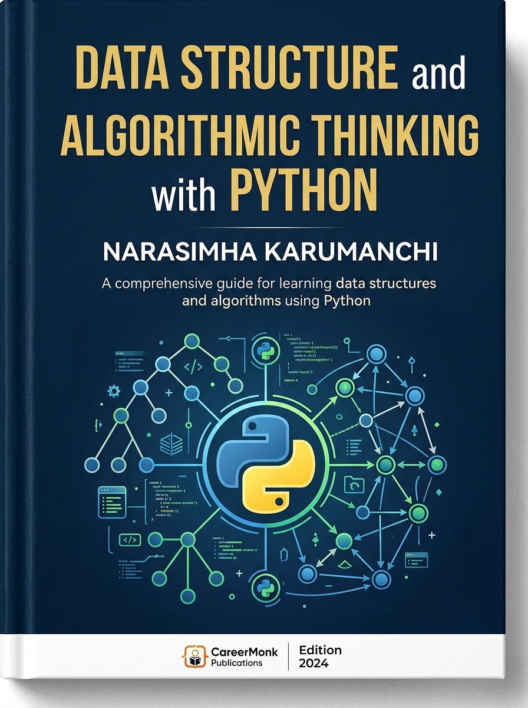
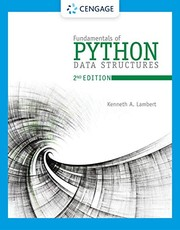
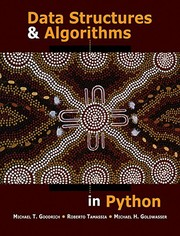
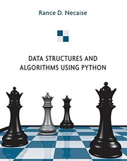

# 🐍 DSAI1002 – Cấu trúc dữ liệu và Giải thuật với Python (Data Structures and Algorithms in Python)

🌐 **Ngôn ngữ / Language:** 🇻🇳 **Tiếng Việt** | [🇬🇧 English Version (README-en.md)](README-en.md)

> **Giảng viên:** TS. Vũ Đức Minh (`minhvd@neu.edu.vn`)  
> **Đơn vị phụ trách:** Khoa Khoa học dữ liệu và Trí tuệ nhân tạo – Trường Đại học Kinh tế Quốc dân (NEU)  
> **Số tín chỉ:** 3 Tín chỉ (45h lý thuyết, 22.5h thực hành, 90h tự học)  
> **Đề cương chi tiết học phần:** Xem tệp [syllabus-vn.md](syllabus-vn.md)

---

## 📌 1. Giới thiệu Học phần & Mục tiêu

Học phần **Cấu trúc dữ liệu và Giải thuật với Python (DSAI1002)** cung cấp kiến thức nền tảng và chuyên sâu về các cấu trúc dữ liệu cơ bản (Mảng, Danh sách liên kết, Ngăn xếp, Hàng đợi, Cây, Bảng băm) và các thuật toán cốt lõi (Tìm kiếm, Sắp xếp, Duyệt cây, Quy hoạch động, Chia để trị). 

Sinh viên được hướng dẫn tự cài đặt (implement from scratch) các cấu trúc dữ liệu và giải thuật bằng **Python**, phân tích độ phức tạp thời gian/bộ nhớ (Big-O notation) và áp dụng vào bài toán thực tế trong Kinh doanh & Tài chính.

### 🎯 Mục tiêu & Chuẩn đầu ra (CLOs):
1. **Phân tích độ phức tạp (G1):** Sử dụng ký hiệu Big-O đánh giá độ phức tạp thời gian và bộ nhớ của thuật toán.
2. **Cấu trúc dữ liệu & Thuật toán (G2):** Thành thạo các ADT, cấu trúc dữ liệu cơ bản & nâng cao và cài đặt từ đầu.
3. **Ứng dụng giải bài toán (G3):** Lựa chọn và thiết kế giải thuật tối ưu cho các bài toán thực tế.
4. **Năng lực tự chủ (G4):** Nâng cao tư duy độc lập, tự học và kỹ năng làm việc nhóm.

---

## 📚 2. Ma trận Bài giảng, Tài liệu & Bài tập Thực hành (Course Matrix by Parts)

Bảng dưới đây tổng hợp chi tiết tài liệu học tập, bài giảng Markdown, slide, bài tập thực hành và lời giải được tổ chức theo các **Phần học (Part)**:

| Phần | Chủ đề chính (Tiếng Việt) | Bài giảng & Bài đọc (.md) | Slide bài giảng | Bài tập & Thực hành | Trạng thái |
|:---:|:---|:---|:---:|:---:|:---:|
| **Part 1** | **Giới thiệu Môn học** | • [Bài giảng: Giới thiệu Học phần & Phân tích Tổng quan](lectures/part-01-gioi-thieu-mon-hoc/introduction-1-vn.md) | • [Slide: Giới thiệu Môn học](lectures/part-01-gioi-thieu-mon-hoc/part-01-slide-course-introduction.pdf) | • [Bài tập: Practice Set 1](lectures/part-01-gioi-thieu-mon-hoc/part-01-practice-set-1.pdf) • [Bài tập: Assignment 1](lectures/part-01-gioi-thieu-mon-hoc/part-01-assignment-1.pdf) | ✅ *Đã sẵn sàng* |
| **Part 2** | **ADT & Lập trình Hướng đối tượng (OOP)** | • [Bài giảng: Lập trình Hướng đối tượng (OOP)](lectures/part-02-adt-va-oop/oop-vn.md) | • [Slide: OOP 1](lectures/part-02-adt-va-oop/part-02-slide-oop-1.pdf) • [Slide: OOP 2](lectures/part-02-adt-va-oop/part-02-slide-oop-2.pdf) | • [Bài tập: OOP & ADT Exercise](lectures/part-02-adt-va-oop/part_02_oop_adt_exercise.pdf) | ✅ *Đã sẵn sàng* |
| **Part 3** | **Thuật toán & Phân tích Độ phức tạp** | Tổng quan Thuật toán, Phân tích Độ phức tạp Big-O, Định lý Master & Đệ quy | - | - | ⏳ *Đang cập nhật* |
| **Part 4** | **Nền tảng Thuật toán & Phương pháp Tiếp cận** | Khái niệm & Biểu diễn, Phương pháp Đệ quy, Kỹ thuật Chia để trị, Tham ăn & Quy hoạch động | - | - | ⏳ *Đang cập nhật* |
| **Part 5** | **Thuật toán Tìm kiếm & Sắp xếp** | Thuật toán Tìm kiếm tuyến tính/nhị phân, Bubble Sort, Selection Sort, Insertion Sort, Merge Sort, Quick Sort | - | - | ⏳ *Đang cập nhật* |
| **Part 6** | **Cấu trúc Dữ liệu Tuyến tính** | Cấu trúc dữ liệu Mảng, Danh sách liên kết đơn/đôi, Ngăn xếp (Stack), Hàng đợi (Queue), Hàng đợi hai đầu (Deque) | - | - | ⏳ *Đang cập nhật* |
| **Part 7** | **Cấu trúc Dữ liệu Phi tuyến tính** | Khái niệm Cây, Duyệt cây, Cây tìm kiếm nhị phân (BST), Cây cân bằng AVL, Hàng đợi ưu tiên & Min/Max Heap | - | - | ⏳ *Đang cập nhật* |
| **Part 8** | **Bảng băm & Giải thuật Nâng cao** | Hàm băm (Hash Function), Bảng băm (Hash Table), Các chiến lược xử lý đụng độ (Chaining, Open Addressing) | - | - | ⏳ *Đang cập nhật* |

---

## 📖 3. Sách tham khảo (References & Textbooks)

| Bìa sách | Tài liệu | Tác giả | Nhà xuất bản | ISBN | Liên kết |
|:---:|:---|:---|:---|:---:|:---:|
|  | **Data Structure and Algorithmic Thinking with Python** | Narasimha Karumanchi | CareerMonk Publications, 2020 | 9788194254003 | [Thông tin sách](https://careermonk.com/) |
|  | **Fundamentals of Python: Data Structures**, 2nd Edition | Kenneth A. Lambert | Cengage Learning, 2019 | 9780357122754 | [Thông tin sách](https://www.cengage.com/c/fundamentals-of-python-data-structures-2e-lambert/9780357122754) |
|  | **Data Structures and Algorithms in Python** | Michael T. Goodrich, Roberto Tamassia, Michael H. Goldwasser | Wiley, 2013 | 9781118290279 | [Thông tin sách](https://www.wiley.com/en-us/Data+Structures+and+Algorithms+in+Python-p-9781118290279) |
|  | **Data Structures and Algorithms Using Python** | Rance D. Necaise | Wiley, 2011 | 9780470618295 | [Thông tin sách](https://www.wiley.com/en-us/Data+Structures+and+Algorithms+Using+Python-p-9780470618295) |

---

> © 2026 TS. Vũ Đức Minh - Khoa Khoa học dữ liệu & Trí tuệ nhân tạo (NEU). Bản quyền tài liệu thuộc về tác giả.
