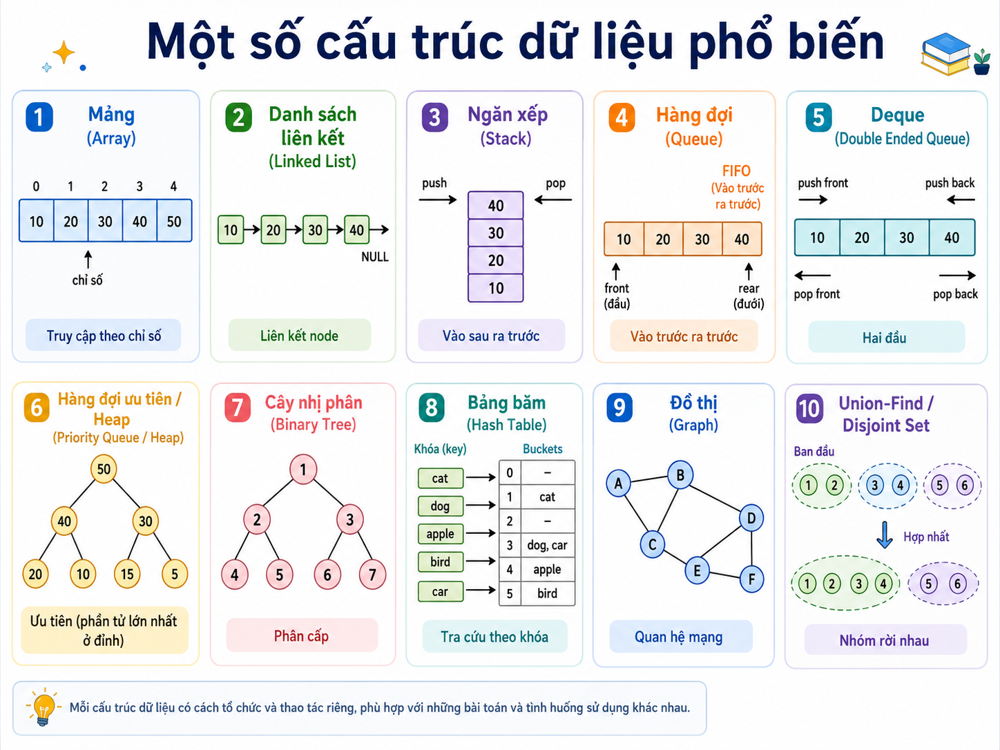
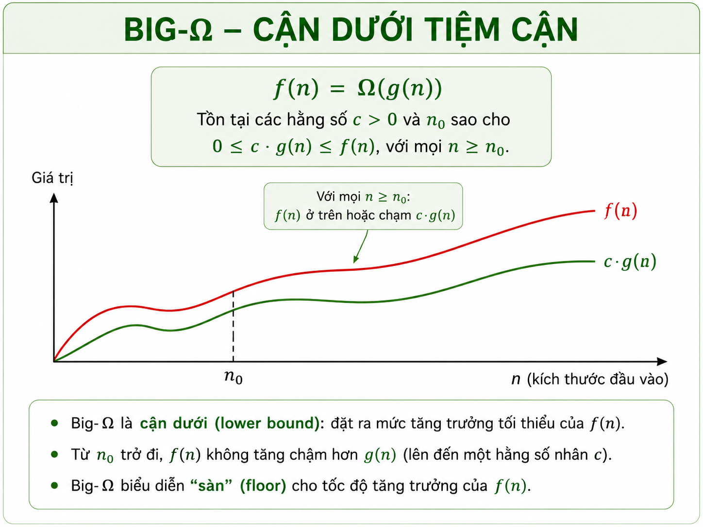

# Lecture: Introduction to Algorithms and Complexity Analysis

**Last updated:** August 03, 2026

## 1. Objectives and Prerequisites

This lesson introduces the most foundational concepts before diving deep into data structures and algorithms. The goal is not only to understand how an algorithm works, but also to know how to **compare algorithms**, evaluating which algorithm is more suitable as the data size grows.

After this lesson, learners will be able to:

- Explain the relationship between **variables, data types, data structures, and abstract data types**.
- State the definition and basic characteristics of an algorithm.
- Explain why algorithm analysis is necessary.
- Determine the appropriate input size for each problem.
- Compare the growth rates of commonly encountered functions.
- Distinguish between **best case, average case, and worst case**.
- Correctly use asymptotic notations `O`, `Ω`, and `Θ`.
- Analyze simple code snippets containing loops, nested loops, sequential statements, conditional statements, and logarithmic loops.
- Apply basic logarithmic and summation formulas in complexity analysis.

Prerequisite knowledge required:

- Variables, assignments, and expressions.
- `if`, `for`, `while`.
- Functions and function calls.
- Basic arrays/lists.
- Introductory exponents and logarithms.

---

## 2. From Variables and Data Types to Data Structures and ADTs

In mathematics, we often write equations like `x² + 2y − 2 = 1`. Here, `x` and `y` are variable names representing some value. In programming, variables play a similar role: a variable name is a **placeholder** used to represent data.

Example:

```python
x = 10
y = 25
total = x + y
```

A variable name is not the data itself, but rather the means for us to access and manipulate data.

A variable cannot hold all types of values in the same way. We need to know what type the data belongs to:

- integers,
- floating-point numbers,
- characters,
- strings,
- boolean values,
- or user-defined data types.

Example:

```python
age = 20 # int
price = 19.95 # float
name = "Minh" # str
is_valid = True # bool
```

A data type determines:

- the range of representable values;
- the amount of memory required;
- which operations are valid.

A 16-bit integer type can represent fewer values than a 32-bit integer type. However, in Python, integers can automatically expand in size as needed and are not limited to fixed sizes like standard integer types in C/C++.

In addition to built-in types, we can construct user-defined data types:

```python
class NewType:
 def __init__(self, data1, data2, data3):
 self.data1 = data1
 self.data2 = data2
 self.data3 = data3
```

Defining custom data types helps model more complex objects in a problem.

As data volume grows, we need an organization mechanism to make access and processing more efficient. That is the role of **data structures**.

A data structure is a way of organizing and storing data in memory so that data can be used efficiently.


An **ADT — Abstract Data Type** describes a data structure through:

1. the managed data set;
2. the set of allowable operations.

An ADT only describes **what can be done**, without specifying in detail **how it is done**.


> **An ADT describes interface and behavior; a specific data structure describes the implementation.**

## Abstract Data Types and Common Data Structures

An **Abstract Data Type** (*ADT*) is a mathematical or logical model that describes:

1. **The set of data objects** being managed;
2. **The set of operations** that can be performed on those objects;
3. **The expected behavior** of each operation.

An ADT focuses on the question:

> **What operations does this structure provide, and how must those operations behave?**

An ADT does not directly specify how data is stored in memory or which algorithm is used to implement each operation.

In contrast, a **data structure implementation** determines how data is actually organized in memory and how the ADT operations are implemented.

For example, the Stack ADT defines the **Last-In, First-Out — LIFO** principle and typically provides operations such as `push`, `pop`, and `top`. However, a Stack can be implemented using:

- static arrays;
- dynamic arrays;
- linked lists.

These implementations all provide the same Stack ADT interface but may differ in time cost, memory overhead, and capacity management.

The relationship can be summarized as follows:

> **An ADT specifies how data can be used; a data structure specifies how data is organized and processed in memory.**

---

## Common ADTs and Data Structures

Commonly encountered data structures include:

- Array / Dynamic Array
- Linked List
- Stack
- Queue
- Deque
- Priority Queue
- Binary Tree
- Binary Search Tree
- Heap
- Dictionary / Map
- Hash Table
- Set
- Graph
- Disjoint Set / Union-Find

Each structure is suitable for different types of operations and problem categories.

<p align="center">
  
</p>
## Comparison of Common Operations Across Data Structures

Notation:

- **✓**: operation is directly supported and is a typical core capability of the data structure;
- **△**: operation can be performed but is not a core operation or may be inefficient;
- **—**: operation is not directly supported or is unsuitable for the nature of the data structure.

| Operation | Short Description | Array | Linked List | Stack | Queue | Deque | Priority Queue / Heap | BST | Hash Table / Map | Set | Graph | Union-Find |
|---|---|:---:|:---:|:---:|:---:|:---:|:---:|:---:|:---:|:---:|:---:|:---:|
| Index-based access | Retrieve element at position `i` | ✓ | △ | — | — | △ | △ | — | — | — | — | — |
| Sequential traversal | Access elements one by one | ✓ | ✓ | △ | △ | ✓ | △ | ✓ | ✓ | ✓ | ✓ | △ |
| Search by value | Check whether a value exists | △ | △ | △ | △ | △ | △ | ✓ | ✓ | ✓ | △ | — |
| Insert element | Add a new element | ✓ | ✓ | ✓ | ✓ | ✓ | ✓ | ✓ | ✓ | ✓ | ✓ | △ |
| Delete element | Remove an element | △ | ✓ | ✓ | ✓ | ✓ | ✓ | ✓ | ✓ | ✓ | ✓ | — |
| Insert/delete at front | Operation at the front of the structure | △ | ✓ | — | ✓ | ✓ | — | — | — | — | — | — |
| Insert/delete at end | Operation at the end of the structure | ✓ | ✓ | ✓ | ✓ | ✓ | — | — | — | — | — | — |
| Get highest priority element | Retrieve smallest or largest element based on priority criteria | △ | △ | — | — | — | ✓ | ✓ | △ | △ | — | — |
| Key lookup | Retrieve value corresponding to a key | — | — | — | — | — | — | ✓ | ✓ | △ | △ | — |
| Membership test | Check whether an element belongs to the structure | △ | △ | △ | △ | △ | △ | ✓ | ✓ | ✓ | △ | — |
| Find min/max element | Determine extremum element | △ | △ | — | — | — | ✓ | ✓ | △ | △ | — | — |
| Find predecessor/successor | Find immediately preceding or succeeding element in order | — | — | — | — | — | — | ✓ | — | △ | — | — |
| BFS traversal | Level-by-level expansion | — | — | — | ✓ | ✓ | — | — | — | — | ✓ | — |
| DFS traversal | Deep-first before backtracking | — | — | ✓ | — | △ | — | — | — | — | ✓ | — |
| Represent relationships between objects | Store nodes and relationships between them | △ | △ | — | — | — | — | ✓ | △ | △ | ✓ | — |
| Merge two components | Combine two disjoint groups of elements | — | — | — | — | — | — | — | — | △ | △ | ✓ |
| Check if two elements are in same group | Determine whether two elements belong to the same component | — | — | — | — | — | — | — | — | △ | △ | ✓ |
---


## Relationship with Data Science, AI, Machine Learning, and Operations Research

Data structures are not only foundational concepts in programming but also core components of many algorithms in Data Science, AI, Machine Learning, and Operations Research. The relationship between data structures and algorithms often stems from the type of operation that needs to be performed with the highest frequency.

In Data Science, Array, Matrix, Dictionary, and Set are commonly used to represent data tables, feature vectors, frequency statistics, and distinct value sets. In Machine Learning, Trees form the foundation of Decision Trees, Random Forests, and Gradient Boosted Trees; Heaps maintain top-k candidates; Hash Tables support sparse feature processing and categorical data. In Deep Learning, tensors are multi-dimensional extensions of arrays, while graphs are used to represent computational graphs or relational data.

In AI, the choice of data structure directly impacts search strategies. BFS uses Queues to expand states level by level; DFS and backtracking use Stacks; A* and uniform-cost search use Priority Queues to select the state with the best priority value. For constraint satisfaction problems, stacks or state-tracking structures support trial, contradiction detection, and backtracking.

In Operations Research, Graphs are natural models for shortest path, flow, routing, assignment, scheduling, and network design. Priority Queues appear in Dijkstra, label-setting algorithms, event simulation, and branch-and-bound; Union-Find is used in Kruskal's algorithm and connectivity problems; Arrays, Matrices, and Hash Tables are often used to store dynamic programming states or temporary info in heuristics and metaheuristics. In simulation, Queues represent entities awaiting service, while Priority Queues manage the chronological order of events.

The key takeaway is:

> **There is no single best data structure for every problem. The appropriate structure is the one that most efficiently supports the dominant operations of the algorithm under consideration.**

---

## 3. Concept of Algorithm and the Need for Algorithm Analysis

Consider an everyday task: making an omelette.

A process might be:

```text
1. Get pan.
2. Get oil.
3. If out of oil:
 - go buy oil;
 - return to kitchen.
4. Pour oil into pan.
5. Turn on stove.
6. Crack eggs and cook.
7. Finish.
```

This is a step-by-step procedure to achieve a goal.

An **algorithm** is a finite sequence of clearly described, unambiguous steps to solve a problem or perform a computation.

When learning algorithms, we do not only care:

> Does the algorithm produce the correct answer?

We must also care:

> How much time and how much memory does the algorithm require?

The same problem can be solved by multiple different algorithms. This can be visualized as traveling from city A to city B using different modes of transportation; all options achieve the same goal but differ in time, cost, and feasibility.

In computing, correctness is necessary but not sufficient; efficiency in time, memory, and scalability are also crucial criteria when choosing an algorithm.

---

## 4. Goals of Algorithm Analysis and Determining Input Size

The goal of **algorithm analysis** is to evaluate and compare algorithms based on resource criteria, primarily including:

- running time;
- memory usage;
- and sometimes other resources.

Within the scope of this lesson, the focus is placed on **running time**.

Running time analysis considers the question:

> As input size increases, according to what rule does processing time grow?

Determining the correct **input size** is a prerequisite to representing complexity accurately.

| Problem | Commonly Used Input Size |
|---|---|
| Array | number of elements `n` |
| Polynomial | degree of polynomial |
| Matrix | number of elements or rows/columns |
| Large integer | number of bits or digits |
| Graph | number of vertices `V` and edges `E` |

Not every problem is fully described by a single parameter `n`.

Example:

```text
Graph algorithm → usually expressed in terms of V and E
Matrix algorithm → may need expression in terms of r and c
```

If we choose the wrong input size, conclusions about complexity can become ambiguous or misleading.

---

## 5. Comparing Algorithms and Growth Rates

There are multiple criteria to compare algorithms, but some criteria do not accurately reflect scalability as input size increases.

### Limitations of Relying Solely on Empirical Timing

Actual running time depends on:

- CPU,
- RAM,
- programming language,
- compiler/interpreter,
- operating system,
- libraries,
- specific input data.

Therefore, saying:

```text
Algorithm A took 0.2 seconds.
```

is insufficient to conclude that A is generally better than B.

### Limitations of Using Source Code Line Count

A program with fewer lines of code is not necessarily faster.

Example:

```python
result = sorted(arr)
```

has only one line, but internally executes an entire sorting algorithm.

### Comparison via Growth Rates

Running time can be described by a function of input size, denoted as `T(n)`. For example, one might see `T₁(n) = n`, `T₂(n) = n log n`, or `T₃(n) = n²`.

When `n` grows very large, order of growth matters more than constants.

For instance, with `T(n) = n⁴ + 2n² + 100n + 500`, when `n` is large, `n⁴` completely dominates the remaining terms. Thus, `T(n) = Θ(n⁴)`.

In asymptotic analysis, constant coefficients and lower-order terms are usually omitted because they do not determine the growth order when input size is sufficiently large:

```text
3n + 20 → Θ(n)
7n² + 5n + 100 → Θ(n²)
100n log n + n → Θ(n log n)
```

---

## 6. Common Growth Rates

Common growth rates:

| Complexity | Name | Example |
|---|---|---|
| `Θ(1)` | Constant | access element by index |
| `Θ(log n)` | Logarithmic | binary search |
| `Θ(n)` | Linear | traverse an array |
| `Θ(n log n)` | Linearithmic | merge sort |
| `Θ(n²)` | Quadratic | examine all pairs of elements |
| `Θ(n³)` | Cubic | three independent nested loops |
| `Θ(2^n)` | Exponential | subset traversal in binary tree |
| `Θ(n!)` | Factorial | generate all permutations |

Typical growth ordering, from slow to fast, is represented as follows:

<p align="center">
  
</p>

Noteworthy relations include `2^(log₂ n) = n` and `log(n!) = Θ(n log n)`.

Functions with larger growth rates lead to poorer scalability as input size grows.

---

## 7. Best Case, Average Case, and Worst Case

The running time of an algorithm can differ significantly across inputs of the same size.

Therefore, analysis typically considers three cases: best, average, and worst.

### Worst case

The worst case (*worst case*) is the class of inputs of the same size that maximizes execution cost of the algorithm.

Example with linear search:

```python
def linear_search(arr, target):
 for i, x in enumerate(arr):
 if x == target:
 return i
 return -1
```

Worst case occurs when:

- `target` is at the end of the array;
- or does not exist in the array.

The number of comparisons is `n`, so **worst case complexity is `Θ(n)`**.

### Best case

The best case (*best case*) is the class of inputs of the same size that minimizes execution cost of the algorithm.

For linear search, if the sought element is at the very first position, **best case complexity is `Θ(1)`**.

### Average case

The average case (*average case*) describes expected execution cost under a specified probability distribution over the input set.

The average case value cannot be derived simply by taking the arithmetic mean of best case and worst case.

We must describe how inputs are generated.

For example, if the target is guaranteed to exist and is equally likely at each position, the average number of comparisons is:

```text
(1 + 2 + ... + n) / n
= (n + 1) / 2
= Θ(n)
```

In general, we have the relation `Lower Bound ≤ Average Time ≤ Upper Bound`.

However, a distinction must be made:

- best/worst/average case refer to categories of input;
- `O`, `Ω`, `Θ` are asymptotic notations describing function bounds.

These two concepts are related but not identical.

---

## 8. Asymptotic Analysis and O, Ω, Θ Notations

Asymptotic analysis studies the behavior of cost functions as `n → ∞`, thereby focusing on long-term growth rates and ignoring differences due to constant multipliers or lower-order terms.

### Big-O: Asymptotic Upper Bound

We say `f(n) = O(g(n))` if there exist positive constants `c` and `n₀` such that `0 ≤ f(n) ≤ c·g(n)` for all `n ≥ n₀`.

Visual interpretation:

> `g(n)` is an upper bound for the growth rate of `f(n)`.

<p align="center">
  
</p>

For example, consider `f(n) = 3n + 8`. For `n ≥ 8`, we have `3n + 8 ≤ 3n + n = 4n`; hence `3n + 8 = O(n)`.

A function can satisfy multiple asymptotic upper bounds simultaneously:

```text
3n + 8 = O(n)
3n + 8 = O(n²)
3n + 8 = O(n³)
```

However, among these upper bounds, `O(n)` provides the tighter description of growth order.

Similarly, since `n² + 1 ≤ 2n²` for all `n ≥ 1`, it follows that `n² + 1 = O(n²)`.

#### Examples of Big-O

The examples below illustrate direct application of the Big-O definition by choosing suitable constants `c` and `n₀`.

**Example 1. Find upper bound for `f(n) = 3n + 8`.**

For all `n ≥ 8`, we have `3n + 8 ≤ 3n + n = 4n`. Choose `c = 4` and `n₀ = 8`, implying `3n + 8 = O(n)`.

**Example 2. Find upper bound for `f(n) = n² + 1`.**

For all `n ≥ 1`, we have `n² + 1 ≤ 2n²`. Choose `c = 2` and `n₀ = 1`, hence `n² + 1 = O(n²)`.

**Example 3. Find upper bound for `f(n) = n⁴ + 100n² + 50`.**

For `n ≥ 11`, we have `n⁴ + 100n² + 50 ≤ 2n⁴`. Choose `c = 2` and `n₀ = 11`, implying `n⁴ + 100n² + 50 = O(n⁴)`.

**Example 4. Find upper bound for `f(n) = 2n³ - 2n²`.**

For all `n ≥ 1`, we have `2n³ - 2n² ≤ 2n³`. Choose `c = 2` and `n₀ = 1`, hence `2n³ - 2n² = O(n³)`.

**Example 5. Find upper bound for `f(n) = n`.**

For all `n ≥ 1`, obviously `n ≤ n`. Choose `c = 1` and `n₀ = 1`, implying `n = O(n)`.

**Example 6. Find upper bound for constant function `f(n) = 410`.**

For all `n ≥ 1`, we have `410 ≤ 410`. Choose `g(n) = 1`, `c = 410`, and `n₀ = 1`, implying `410 = O(1)`.

**Example 7. The constant pair `c` and `n₀` is not unique**

Consider `100n + 5 = O(n)`. One choice uses inequality `100n + 5 ≤ 100n + 5n = 105n` for all `n ≥ 1`; then we can choose `c = 105` and `n₀ = 1`.

This choice is not unique. For instance, choosing a larger `c` may still yield an appropriate `n₀`. The key point is that there **exists** at least one pair of positive constants `c, n₀` satisfying the definition.

---

### Big-Ω: Asymptotic Lower Bound

We say `f(n) = Ω(g(n))` if there exist `c > 0` and `n₀` such that `0 ≤ c·g(n) ≤ f(n)` for all `n ≥ n₀`.

Visual interpretation:

> `g(n)` is a lower bound for the growth rate of `f(n)`.

<p align="center">
  
</p>

For example, with `f(n) = 5n²`, choosing `c = 5` yields `5n² ≥ 5n²`, so `5n² = Ω(n²)`.

Another example, `100n + 5 = Ω(n)` because `100n + 5 ≥ 100n`.

#### Examples of Big-Ω

**Example 1. Find lower bound for `f(n) = 5n²`.**

For all `n ≥ 1`, we have `5n² ≥ 5n²`. Choose `c = 5` and `n₀ = 1`, implying `5n² = Ω(n²)`.

**Example 2. Prove `100n + 5 ∉ Ω(n²)`.**

Suppose to the contrary that there exist `c > 0` and `n₀` such that `cn² ≤ 100n + 5` for all `n ≥ n₀`. For `n ≥ 1`, we also have `100n + 5 ≤ 100n + 5n = 105n`, so `cn² ≤ 105n`, or equivalently `n ≤ 105/c`.

However, `105/c` is a finite constant, whereas `n` can be arbitrarily large. Contradiction. Therefore, `100n + 5 ∉ Ω(n²)`.

**Example 3. Simple relations.**

The following relations all hold: `2n = Ω(n)`, `n³ = Ω(n³)` and `log n = Ω(log n)`.

---

### Theta: Asymptotic Tight Bound

We say `f(n) = Θ(g(n))` if `f(n)` is both `O(g(n))` and `Ω(g(n))`. That is, there exist `c₁ > 0`, `c₂ > 0`, and `n₀ > 0` such that `0 ≤ c₁g(n) ≤ f(n) ≤ c₂g(n)` for all `n ≥ n₀`.

<p align="center">
  
</p>

For example, with `f(n) = 6n³`, we simultaneously have `6n³ = O(n³)` and `6n³ = Ω(n³)`, so `6n³ = Θ(n³)`.

Another example is `f(n) = (n² - n)/2`; this function has growth order `Θ(n²)`.

Concise summary:

- `O(g(n))`: does not grow faster than `g(n)` asymptotically.
- `Ω(g(n))`: does not grow slower than `g(n)` asymptotically.
- `Θ(g(n))`: grows at the exact same order as `g(n)`.

---

#### Examples of Theta

**Example 1. Prove `f(n) = n²/2 - n/2 = Θ(n²)`.**

For `n ≥ 2`, we can choose positive constants such that `(1/5)n² ≤ n²/2 - n/2 ≤ n²`. Thus we can pick `c₁ = 1/5`, `c₂ = 1`, and `n₀ = 2`, implying `n²/2 - n/2 = Θ(n²)`.

**Example 2. Prove `n ∉ Θ(n²)`.**

If `n = Θ(n²)`, there must exist `c₁, c₂ > 0` such that `c₁n² ≤ n ≤ c₂n²` for all sufficiently large `n`. However, the left inequality `c₁n² ≤ n` is equivalent to `n ≤ 1/c₁`, which cannot hold for all large `n`. Thus `n ∉ Θ(n²)`.

**Example 3. Prove `6n³ ∉ Θ(n²)`.**

If this held true, there must exist `c₁, c₂ > 0` such that `c₁n² ≤ 6n³ ≤ c₂n²` for all sufficiently large `n`. From the right inequality `6n³ ≤ c₂n²`, we get `n ≤ c₂/6`, which cannot hold for all large `n`. Therefore `6n³ ∉ Θ(n²)`.

**Example 4. Prove `n ∉ Θ(log n)`.**

If `n = Θ(log n)`, there must exist `c₁, c₂ > 0` such that `c₁ log n ≤ n ≤ c₂ log n` for all sufficiently large `n`. From `n ≤ c₂ log n`, we get `c₂ ≥ n/log n`. But `n/log n → ∞` as `n → ∞`, so no finite constant `c₂` satisfies the condition for all large `n`. Thus `n ∉ Θ(log n)`.

---

## 9. Properties of Asymptotic Notations

The following properties are commonly used when simplifying expressions.

### Transitivity

If `f(n) = O(g(n))` and `g(n) = O(h(n))`, then `f(n) = O(h(n))`. Similar properties hold for `Ω` and `Θ`.

### Reflexivity

It always holds that `f(n) = O(f(n))`, `f(n) = Ω(f(n))`, and `f(n) = Θ(f(n))`.

### Symmetry of Theta

The relation `f(n) = Θ(g(n)) ⇔ g(n) = Θ(f(n))` always holds.

### Relationship between O and Ω

The relation `f(n) = O(g(n)) ⇔ g(n) = Ω(f(n))` always holds.

### Sum Rule

If `f₁(n) = O(g₁(n))` and `f₂(n) = O(g₂(n))`, then `f₁(n) + f₂(n) = O(max(g₁(n), g₂(n)))`. For example, `n² + n log n = Θ(n²)`.

### Product Rule

If `f₁(n) = O(g₁(n))` and `f₂(n) = O(g₂(n))`, then `f₁(n)f₂(n) = O(g₁(n)g₂(n))`. For example, `n × log n = Θ(n log n)`.

---

## 10. Rules for Analyzing Common Code Snippets

### Single Loop

```python
for i in range(n):
 print(i)
```

The loop body runs `n` times. If each execution takes `Θ(1)`, total time is `T(n) = n · Θ(1) = Θ(n)`.

### Nested Loops

```python
for i in range(n):
 for j in range(n):
 print(i, j)
```

The outer loop runs `n` times. For each iteration of outer loop, inner loop runs `n` times.

Therefore `T(n) = n × n = Θ(n²)`. If three independent loops each run `n` times, complexity is `Θ(n³)`.

### Sequential Statements

```python
for i in range(n):
 work_a()

for j in range(n):
 work_b()
```

Total cost is `Θ(n) + Θ(n) = Θ(2n) = Θ(n)`.

If `T₁(n) = Θ(n)` and `T₂(n) = Θ(n²)`, then `T(n) = Θ(n + n²) = Θ(n²)`.

### If-Else Statements

Example:

```python
if n == 1:
 print("Wrong Value")
else:
 for i in range(n):
 print(i)
```

Worst-case time is `Θ(n)` because in worst-case analysis we evaluate the more time-consuming branch.

In general, for worst case, `T_ifelse = cost(condition) + max(cost(then), cost(else))`.

### Logarithmic Loops

Example:

```python
i = 1
while i < n:
 i *= 2
```

Values of `i`:
 `1, 2, 4, 8, 16, ...` 
After `k` iterations, `i = 2^k`. Loop terminates when `2^k ≥ n`, giving `k ≥ log₂n`; thus `T(n) = Θ(log n)`.

Similarly:

```python
i = n
while i > 1:
 i //= 2
```

also has complexity `Θ(log n)`.

### Dependent Loops

Example:

```python
for i in range(n):
 for j in range(i):
 work()
```

Number of executions is `0 + 1 + 2 + ... + (n - 1)`. We have `0 + 1 + 2 + ... + (n - 1) = n(n - 1)/2 = Θ(n²)`.

Complexity cannot be determined solely by counting loop levels; actual loop body executions must be computed.

---

### Code Analysis Examples

The examples below illustrate common analysis rules for loops, sequential statements, conditional branches, and exponentially decreasing processes.

**Example 1. Single loop**

```python
for i in range(0, n):
 print("Current Number:", i, sep="")
```

If loop body takes constant time `c`, total time is `T(n) = c × n = O(n)`.

**Example 2. Two nested loops**

```python
for i in range(0, n):
 for j in range(0, n):
 print(i, j)
```

Total loop body executions is `n × n = n²`, hence `T(n) = O(n²)`.

**Example 3. Sequential statements**

```python
n = 100

for i in range(n):
 print("Current Number:", i, sep="")

for i in range(n):
 for j in range(n):
 print(i, j)
```

Total running time can be expressed as `T(n) = c₀ + c₁n + c₂n²`. Dominant term is `n²`, so `T(n) = O(n²)`.

**Example 4. `if-else` statement**

```python
if n == 1:
 print("Wrong Value")
 print(n)
else:
 for i in range(n):
 print("Current Number:", i, sep="")
```

- `if` branch: constant time.
- `else` branch: runs `n` times.

In worst case, `T(n) = c₀ + c₁n = O(n)`.

**Example 5. Doubling logarithmic loop**

```python
def logarithms(n):
 i = 1
 while i < n:
 i = i * 2
 print(i)

logarithms(100)
```

Values of `i` are:
 `1, 2, 4, 8, 16, ...` 
After `k` steps, `2^k ≈ n`, so `k = log₂n`. Thus `T(n) = O(log n)`.

**Example 6. Halving logarithmic loop**

```python
def logarithms(n):
 i = n
 while i > 1:
 i = i // 2
 print(i)

logarithms(100)
```

Each step halves size along sequence `n, n/2, n/4, n/8, ...`, so iteration count is `O(log n)`.

**Example 7. Searching word in dictionary by halving**

Suppose we search for a word in a dictionary of `n` pages:

1. Open middle page.
2. If word is in left half, discard right half.
3. If word is in right half, discard left half.
4. Repeat on remaining half.

After each step, candidate pages halve along `n → n/2 → n/4 → n/8 → ...`; thus step count is `O(log n)`.

---

## 11. Useful Logarithmic and Summation Formulas

### Logarithmic Formulas

Key rules include `log(xy) = log x + log y`, `log(x/y) = log x - log y`, `log(x^k) = k log x`, and `log(log n) = log log n`. Base change uses `log_b x = log_a x / log_a b`.

In asymptotic analysis, log base typically does not change growth order; for instance `log₂n = Θ(log₁₀n)`.

### Arithmetic Series

We have formula `1 + 2 + 3 + ... + n = n(n + 1)/2 = Θ(n²)`.

### Geometric Series

For `x ≠ 1`, `1 + x + x² + ... + x^n = (x^(n+1) - 1)/(x - 1)`. For instance, `1 + 2 + 4 + ... + 2^k = 2^(k+1) - 1 = Θ(2^k)`.

### Harmonic Series

Harmonic series satisfies `1 + 1/2 + 1/3 + ... + 1/n = Θ(log n)`.

This appears in algorithms with summations like `n/1 + n/2 + n/3 + ... + n/n`. In that case, `n(1 + 1/2 + ... + 1/n) = Θ(n log n)`.

### Logarithmic Summation

For logarithmic summation, `Σ log k = log(n!) = Θ(n log n)` as `k` ranges from `1` to `n`.

### Power Summation

For `p > -1`, `Σ k^p = Θ(n^(p+1))`. For example, `1² + 2² + ... + n² = Θ(n³)`.

---

## 12. Common Misconceptions in Complexity Analysis

### Confusing Loop Count with Complexity

Two loops do not always imply `Θ(n²)`.

If two loops run sequentially, `Θ(n) + Θ(n) = Θ(n)`; if independently nested, usually `Θ(n × n) = Θ(n²)`.

### Confusing Best Case with Big-Ω

`best case` is a type of input. `Ω` is a lower bound notation.

One should not mechanically equate `Big-O = worst case` and `Big-Omega = best case`.

For instance, if a function has `Worst-case time = Θ(n²)`, then it is simultaneously true that `Worst-case time = O(n²)` and `Worst-case time = Ω(n²)`.

### Looking Only at Code while Ignoring Operation Costs

Example:

```python
arr[:k]
```

is not always `O(1)`; in Python, slicing creates a new list taking time proportional to copied element count.

Similarly:

```python
x in list
```

typically has worst case `Θ(n)`.

### Forgetting to Define Input Size

Analysis cannot be accurate without knowing what `n` represents.

For example with graphs, expressing `O(V + E)` is usually much more precise than writing `O(n)`.

### Using O when Θ can be used

If exact growth order is known, e.g. `T(n) = 3n + 7`, writing `T(n) = Θ(n)` is stronger and more precise than writing `T(n) = O(n)`.

---

## 13. Comprehensive Examples

### Example 1: Single Loop

```python
def example1(n):
 total = 0
 for i in range(n):
 total += i
 return total
```

Loop body runs `n` times, so **time complexity is `Θ(n)` and auxiliary space is `Θ(1)`**.

### Example 2: Two Sequential Loops

```python
def example2(n):
 for i in range(n):
 print(i)

 for j in range(n):
 print(j)
```

Total time is `Θ(n) + Θ(n) = Θ(n)`.

### Example 3: Nested Loops

```python
def example3(n):
 count = 0
 for i in range(n):
 for j in range(n):
 count += 1
 return count
```

Total `count` increments is `n²`, hence **time complexity is `Θ(n²)`**.

### Example 4: Logarithmic Loop

```python
def example4(n):
 i = 1
 count = 0

 while i < n:
 i *= 2
 count += 1

 return count
```

After `k` iterations, `i = 2^k`. Loop terminates when `2^k ≥ n`, so `k = Θ(log n)`.

### Example 5: Harmonic Summation

```python
def example5(n):
 count = 0

 for i in range(1, n + 1):
 j = i
 while j <= n:
 count += 1
 j += i

 return count
```

For each `i`, inner loop runs about `n/i` times. Total iterations is `n/1 + n/2 + ... + n/n = nH_n = Θ(n log n)`.

---

## 14. Self-Test Quiz

### Part A — Multiple Choice

1. Which statement best describes an ADT?

 A. A programming language. 
 B. A way to describe data and operations, independent of specific implementation. 
 C. An integer variable. 
 D. A sorting algorithm.

2. For `T(n) = 5n² + 2n + 100`, growth order is:

 A. `Θ(1)` 
 B. `Θ(n)` 
 C. `Θ(n²)` 
 D. `Θ(n³)`

3. Two sequential loops, each running `n` times, have total complexity:

 A. `Θ(n)` 
 B. `Θ(n²)` 
 C. `Θ(log n)` 
 D. `Θ(2n²)`

4. What is the complexity of the following code snippet?

 ```python
 i = 1
 while i < n:
 i *= 2
 ```

 A. `Θ(1)` 
 B. `Θ(log n)` 
 C. `Θ(n)` 
 D. `Θ(n²)`

5. In linear search, worst case occurs when:

 A. Element is at front of array. 
 B. Element is at a random position. 
 C. Element is at end or does not exist. 
 D. Array has only one element.

6. `f(n) = O(g(n))` means:

 A. `f(n)` always equals `g(n)`. 
 B. `f(n)` is asymptotically bounded above by a constant multiple of `g(n)`. 
 C. `f(n)` is always strictly less than `g(n)` for all `n`. 
 D. `f(n)` is best case.

7. If `f(n) = Θ(g(n))` then:

 A. Has upper bound only. 
 B. Has lower bound only. 
 C. Has both upper and lower bounds of the exact same order. 
 D. Cannot be compared.

8. The summation `1 + 2 + ... + n` has order:

 A. `Θ(log n)` 
 B. `Θ(n)` 
 C. `Θ(n log n)` 
 D. `Θ(n²)`

9. Harmonic summation `1 + 1/2 + ... + 1/n` has order:

 A. `Θ(1)` 
 B. `Θ(log n)` 
 C. `Θ(n)` 
 D. `Θ(n²)`

10. Which statement is FALSE?

 A. `n = O(n²)`. 
 B. `n² = Ω(n)`. 
 C. `n = Θ(n²)`. 
 D. `3n + 5 = Θ(n)`.

<details>
<summary><strong>Quiz Answers</strong></summary>

| Question | Answer |
|---:|:---:|
| 1 | B |
| 2 | C |
| 3 | A |
| 4 | B |
| 5 | C |
| 6 | B |
| 7 | C |
| 8 | D |
| 9 | B |
| 10 | C |

</details>

---

## 15. Practice Exercises

### Exercise 1

Analyze:

```python
for i in range(n):
 print(i)
```

### Exercise 2

Analyze:

```python
for i in range(n):
 for j in range(n):
 print(i, j)
```

### Exercise 3

Analyze:

```python
for i in range(n):
 print(i)

for j in range(n * n):
 print(j)
```

### Exercise 4

Analyze:

```python
i = n
while i > 1:
 i //= 2
```

### Exercise 5

Analyze:

```python
for i in range(n):
 for j in range(i):
 print(i, j)
```

### Exercise 6

Prove `3n + 8 = O(n)` using the Big-O definition.

### Exercise 7

Prove `5n² = Ω(n²)` using the Big-Ω definition.

### Exercise 8

Prove `6n³ + 4n = Θ(n³)`.

### Exercise 9

Given `f(n) = n² + n log n + 100`. Determine its growth order.

### Exercise 10

For linear search:

- state best case;
- worst case;
- average case;
- and explain why average case requires a probability assumption.

---

## 16. Summary

Key points to remember:

- Variables store values; data types describe value domain and operations.
- Data structures organize data; ADTs describe data and operations at an abstract level.
- An algorithm is a finite, unambiguous procedure to solve a problem.
- Algorithm analysis focuses on how time and memory grow with input size.
- One should not rely solely on empirical seconds or line counts to compare algorithms.
- The core of asymptotic analysis is growth rate with respect to input size.
- Commonly encountered orders in increasing speed of growth: `1 < log n < n < n log n < n² < n³ < 2^n < n!`.

- Best, average, and worst cases depend on input type.
- `O` is upper bound, `Ω` is lower bound, `Θ` is tight bound.
- Sequential loops add cost; nested loops multiply or require summations.
- Doubling/halving loops typically yield `Θ(log n)`.
- Arithmetic, geometric, harmonic series and log formulas are basic tools in complexity analysis.
