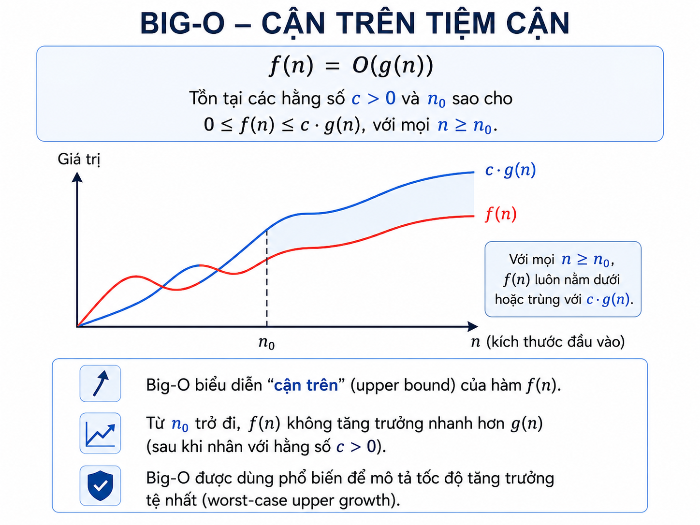
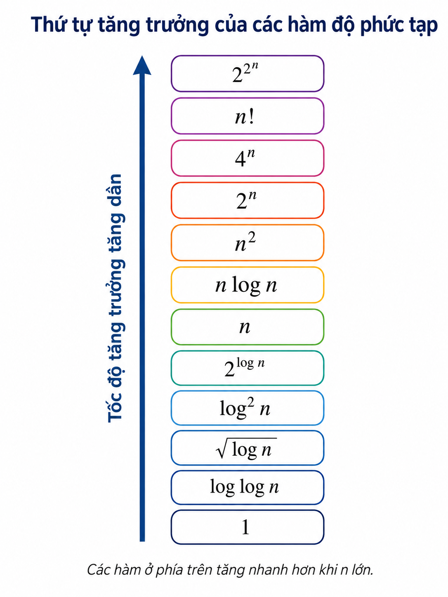
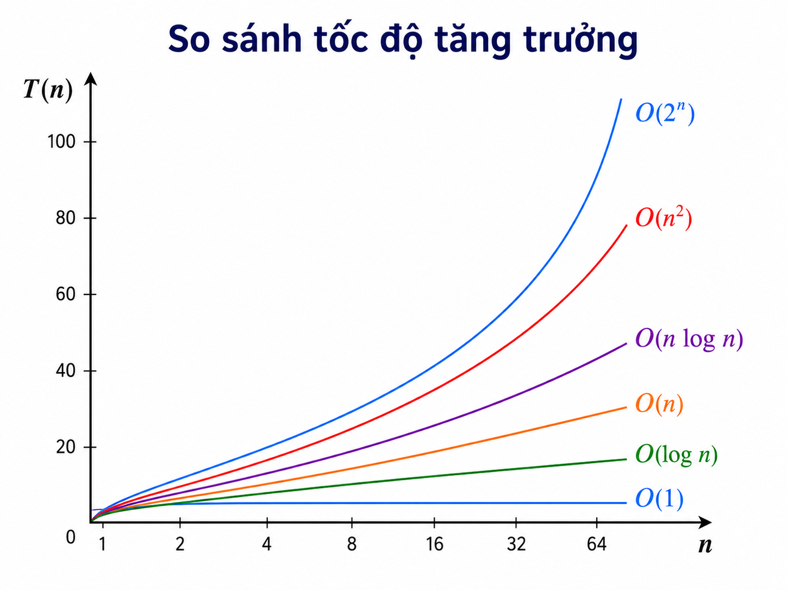

# Bài giảng: Thuật toán là gì? Nhập môn Phân tích Thuật toán

**Cập nhật lần cuối:** 3 tháng 8 năm 2026

## 1. Mục tiêu học tập

Sau bài học này, người học có thể:

1. Giải thích được **thuật toán** là gì và phân biệt thuật toán với chương trình.
2. Nhận biết các đặc tính cơ bản của một thuật toán tốt.
3. Mô tả thuật toán bằng ngôn ngữ tự nhiên, lưu đồ và giả mã.
4. Thiết kế một thuật toán đơn giản từ bài toán, đầu vào, đầu ra và ràng buộc.
5. Phân biệt phân tích **tiên nghiệm** và **hậu nghiệm**.
6. Ước lượng được độ phức tạp thời gian và bộ nhớ cho các thuật toán rất cơ bản.

---

## 2. Khởi động: Vì sao cần thuật toán?

Trong đời sống, ta thường giải quyết công việc bằng một chuỗi bước có thứ tự:

- Nấu một món ăn theo công thức.
- Tìm tên một người trong danh sách.
- Chọn đường đi ngắn nhất đến một địa điểm.
- Sắp xếp danh sách điểm từ cao xuống thấp.
- Phân công xe giao hàng cho nhiều khách hàng.

Khi các bước được mô tả **rõ ràng**, **hữu hạn** và có thể thực hiện được, ta đang sử dụng tư duy thuật toán.

> **Ý tưởng trực giác:** Thuật toán giống như một công thức nấu ăn, nhưng được mô tả đủ chính xác để con người hoặc máy tính đều có thể thực hiện theo.

<p align="center">
  
</p>

---

## 3. Thuật toán là gì?

### 3.1. Định nghĩa

Một **thuật toán** (*algorithm*) là một dãy hữu hạn các chỉ dẫn được xác định rõ ràng, dùng để giải quyết một bài toán hoặc thực hiện một phép tính.

Có thể diễn đạt ngắn gọn:

> Thuật toán nhận dữ liệu đầu vào, thực hiện các bước xử lý rõ ràng, rồi tạo ra kết quả đầu ra sau một số bước hữu hạn.

### 3.2. Mô hình tổng quát

```text
Đầu vào (Input)
      ↓
Các bước xử lý của thuật toán
      ↓
Đầu ra (Output)
```

Ví dụ: tìm số lớn nhất trong ba số.

```text
Input:  num1, num2, num3
Process: so sánh các số
Output: số lớn nhất
```

<p align="center">
  
</p>

---

## 4. Thuật toán khác chương trình như thế nào?

| Khía cạnh | Thuật toán | Chương trình |
|---|---|---|
| Bản chất | Ý tưởng, quy trình giải bài toán | Hiện thực cụ thể của thuật toán |
| Ngôn ngữ | Độc lập với ngôn ngữ lập trình | Viết bằng Python, C++, Java, ... |
| Mức độ chi tiết | Tập trung vào các bước logic | Có cú pháp, kiểu dữ liệu, thư viện, xử lý lỗi |
| Mục tiêu | Mô tả cách giải | Cho máy tính chạy được |

Ví dụ, “duyệt từ trái sang phải và lưu giá trị lớn nhất đã gặp” là **thuật toán**. Viết ý tưởng đó bằng Python hay C++ là **chương trình**.

```python
# Đây là một chương trình Python hiện thực thuật toán tìm max.
def largest_of_three(a, b, c):
    largest = a
    if b > largest:
        largest = b
    if c > largest:
        largest = c
    return largest
```

---

## 5. Vai trò và ứng dụng của thuật toán

Thuật toán là nền tảng để giải quyết bài toán hiệu quả trong nhiều lĩnh vực.

| Lĩnh vực | Ví dụ ứng dụng |
|---|---|
| Khoa học máy tính | Tìm kiếm, sắp xếp, nén dữ liệu, đồ thị, hệ điều hành |
| Toán học | Giải hệ phương trình, tìm đường đi ngắn, tối ưu hóa |
| Nghiên cứu vận hành | Lập lịch, định tuyến xe, phân bổ nguồn lực |
| Trí tuệ nhân tạo | Nhận diện ảnh, xử lý ngôn ngữ, ra quyết định |
| Khoa học dữ liệu | Phân cụm, dự báo, phát hiện bất thường |
| Tài chính | Phát hiện gian lận, phân tích rủi ro, giao dịch tự động |
| Logistics | Tối ưu giao hàng, kho bãi, ghép đơn và tuyến xe |

Điểm quan trọng không chỉ là “có lời giải”, mà còn là lời giải có đủ nhanh và đủ ít tốn tài nguyên để dùng được ở quy mô thực tế.

<p align="center">
  
</p>

---

## 6. Các đặc tính của một thuật toán

Để một tập hướng dẫn được xem là thuật toán, các bước cần có những đặc điểm sau.

### 6.1. Rõ ràng, không mơ hồ (*definiteness*)

Mỗi bước phải có một cách hiểu thống nhất.

- Không tốt: “Chọn một số đủ lớn.”
- Tốt hơn: “Đặt `max_value` bằng phần tử đầu tiên; sau đó so sánh lần lượt với các phần tử còn lại.”

Ví dụ, câu “sắp xếp nhanh danh sách” chưa phải là một chỉ dẫn đủ rõ. Cần nêu cách chọn pivot, cách chia phần tử, điều kiện dừng, và cách ghép kết quả.

### 6.2. Đầu vào được xác định (*input*)

Thuật toán có thể nhận **không có đầu vào** hoặc có một hay nhiều đầu vào, nhưng đầu vào phải được mô tả rõ:

- Kiểu dữ liệu là gì?
- Miền giá trị nào được chấp nhận?
- Có ràng buộc kích thước hay không?

Ví dụ:

```text
Input:
- n: số nguyên dương
- A: mảng gồm n số nguyên
```

### 6.3. Đầu ra được xác định (*output*)

Kết quả cần được xác định rõ. Trong nhiều giáo trình, một thuật toán thường được yêu cầu tạo ra ít nhất một đầu ra; với thủ tục điều khiển hay cập nhật trạng thái, “đầu ra” có thể là trạng thái đã thay đổi.

Ví dụ:

```text
Output:
- max_value: giá trị lớn nhất trong mảng A
```

### 6.4. Tính hữu hạn (*finiteness*)

Thuật toán phải kết thúc sau một số hữu hạn bước đối với mọi đầu vào hợp lệ.

Ví dụ không thỏa mãn:

```python
while True:
    print("Never stop")
```

Đệ quy cũng cần có **điều kiện cơ sở** (*base case*). Nếu không, lời gọi hàm có thể không kết thúc.

```python
def factorial(n):
    if n == 0:           # điều kiện cơ sở
        return 1
    return n * factorial(n - 1)
```

### 6.5. Tính khả thi / hiệu lực (*effectiveness*)

Mỗi thao tác của thuật toán phải đủ đơn giản, có thể thực hiện được trong một lượng tài nguyên hữu hạn.

Ví dụ các thao tác như cộng, so sánh, gán biến, truy cập phần tử mảng, hoặc gọi hàm xác định rõ đều là các bước thực hiện được.

### 6.6. Tính đúng đắn (*correctness*)

Một thuật toán tốt phải trả về kết quả đúng cho mọi đầu vào hợp lệ.

Ví dụ, thuật toán “tìm phần tử lớn nhất” phải luôn trả về một giá trị không nhỏ hơn bất kỳ phần tử nào khác trong danh sách.

### 6.7. Tính xác định và thuật toán ngẫu nhiên

Nhiều thuật toán cổ điển là **xác định** (*deterministic*): cùng một đầu vào luôn dẫn đến cùng một quá trình và đầu ra.

Tuy nhiên, **tính xác định không phải là điều kiện bắt buộc để một quy trình được gọi là thuật toán**. Có các **thuật toán ngẫu nhiên** (*randomized algorithms*) dùng lựa chọn ngẫu nhiên, chẳng hạn chọn ngẫu nhiên pivot trong QuickSort.

- Thuật toán xác định: cùng input → cùng hành vi.
- Thuật toán ngẫu nhiên: cùng input có thể đi qua các bước khác nhau; thường vẫn được thiết kế để đúng với xác suất cao hoặc đúng hoàn toàn nhưng khác thời gian chạy.

### 6.8. Độc lập ngôn ngữ lập trình

Thuật toán không phụ thuộc vào Python, C++, Java hay một ngôn ngữ cụ thể. Một thuật toán có thể được mô tả bằng giả mã và hiện thực bằng nhiều ngôn ngữ khác nhau.

---

## 7. Ba cách phổ biến để biểu diễn thuật toán

### 7.1. Ngôn ngữ tự nhiên

Dùng câu văn thông thường để mô tả các bước.

**Ví dụ:**

1. Đọc ba số.
2. So sánh số thứ nhất với hai số còn lại.
3. Nếu số thứ nhất lớn nhất, in nó.
4. Nếu không, kiểm tra số thứ hai.
5. Trường hợp còn lại, in số thứ ba.

**Ưu điểm:** dễ đọc khi thuật toán đơn giản.  
**Hạn chế:** dễ mơ hồ khi bài toán phức tạp.

### 7.2. Lưu đồ (*flowchart*)

Lưu đồ biểu diễn quy trình bằng ký hiệu đồ họa:

| Ký hiệu | Ý nghĩa |
|---|---|
| Hình bầu dục | Bắt đầu / kết thúc |
| Hình bình hành | Nhập / xuất dữ liệu |
| Hình chữ nhật | Xử lý |
| Hình thoi | Điều kiện rẽ nhánh |
| Mũi tên | Hướng thực hiện |

<p align="center">
  
</p>

**Ưu điểm:** trực quan, dễ thấy nhánh điều kiện và vòng lặp.  
**Hạn chế:** trở nên cồng kềnh với thuật toán lớn.

### 7.3. Giả mã (*pseudocode*)

Giả mã là cách mô tả gần với mã nguồn nhưng không phụ thuộc cú pháp một ngôn ngữ cụ thể.

**Ví dụ:**

```text
ALGORITHM LargestOfThree(num1, num2, num3)
    IF num1 > num2 AND num1 > num3 THEN
        largest ← num1
    ELSE IF num2 > num3 THEN
        largest ← num2
    ELSE
        largest ← num3
    END IF

    OUTPUT largest
END ALGORITHM
```

Giả mã thường là lựa chọn tốt cho việc trình bày và thảo luận thuật toán vì vừa rõ logic vừa không bị phân tán bởi chi tiết cú pháp.

---

## 8. Quy trình thiết kế thuật toán

Trước khi viết code, hãy thiết kế lời giải theo các bước sau.

### Bước 1. Xác định bài toán

Trả lời: cần giải quyết điều gì?

Ví dụ:

```text
Bài toán: Tìm số lớn nhất trong ba số.
```

### Bước 2. Xác định đầu vào

```text
Input: ba số num1, num2, num3.
```

### Bước 3. Xác định đầu ra

```text
Output: giá trị lớn nhất trong ba số.
```

### Bước 4. Xác định ràng buộc

Ràng buộc giúp ta chọn cách giải phù hợp.

```text
- Các đầu vào là số.
- Có thể là số nguyên hoặc số thực.
- Ba số có thể bằng nhau.
```

### Bước 5. Đề xuất ý tưởng giải

```text
Dùng so sánh điều kiện để xác định số không nhỏ hơn hai số còn lại.
```

### Bước 6. Viết giả mã hoặc lưu đồ

Mô tả chính xác các bước, nhánh và điều kiện dừng.

### Bước 7. Kiểm tra bằng các trường hợp mẫu

Không chỉ kiểm tra trường hợp “bình thường”, mà cần chú ý:

- Các giá trị bằng nhau.
- Giá trị âm.
- Giá trị biên.
- Dữ liệu rỗng, nếu bài toán cho phép.
- Kích thước rất lớn, nếu cần đánh giá hiệu năng.

### Bước 8. Phân tích độ phức tạp

Ước lượng thời gian chạy và bộ nhớ phụ trợ trước khi hiện thực hoặc trước khi tối ưu.

<p align="center">
  
</p>

---

## 9. Ví dụ xuyên suốt: tìm số lớn nhất trong ba số

### 9.1. Đặc tả bài toán

```text
Problem: Find the largest of three numbers.

Input:
- num1, num2, num3: ba số hợp lệ.

Output:
- largest: giá trị lớn nhất trong ba số.
```

### 9.2. Giả mã

```text
ALGORITHM LargestOfThree(num1, num2, num3)
    IF num1 >= num2 AND num1 >= num3 THEN
        largest ← num1
    ELSE IF num2 >= num3 THEN
        largest ← num2
    ELSE
        largest ← num3
    END IF

    OUTPUT largest
END ALGORITHM
```

> Lưu ý: dùng `>=` thay vì `>` giúp mô tả rõ trường hợp có các giá trị bằng nhau, dù cả hai cách đều có thể được điều chỉnh để trả lời đúng.

### 9.3. Hiện thực bằng Python

```python
def largest_of_three(num1, num2, num3):
    if num1 >= num2 and num1 >= num3:
        largest = num1
    elif num2 >= num3:
        largest = num2
    else:
        largest = num3

    return largest


# Ví dụ chạy thử
print(largest_of_three(12, 25, 18))  # 25
print(largest_of_three(7, 7, 3))     # 7
print(largest_of_three(-4, -9, -2))  # -2
```

### 9.4. Phân tích

- Số phép so sánh bị chặn bởi một hằng số.
- Không phụ thuộc vào giá trị cụ thể của ba số.
- Dùng một số lượng biến cố định.

Do đó:

```text
Time Complexity: O(1)
Auxiliary Space: O(1)
```

---

## 10. Một bài toán có thể có nhiều thuật toán

Cùng một bài toán có thể có nhiều cách giải khác nhau.

### Ví dụ: tìm giá trị lớn nhất trong ba số

**Cách 1 — So sánh điều kiện**

```python
def max_by_conditions(a, b, c):
    if a >= b and a >= c:
        return a
    if b >= c:
        return b
    return c
```

**Cách 2 — Dùng hàm có sẵn**

```python
def max_by_builtin(a, b, c):
    return max(a, b, c)
```

**Cách 3 — Sắp xếp rồi lấy phần tử cuối**

```python
def max_by_sorting(a, b, c):
    values = [a, b, c]
    values.sort()
    return values[-1]
```

Với đúng ba số, cả ba cách đều có độ phức tạp tiệm cận là `O(1)` vì số phần tử là hằng số. Tuy nhiên:

- Cách 1 thể hiện trực tiếp tư duy thuật toán.
- Cách 2 ngắn gọn và phù hợp khi dùng thư viện.
- Cách 3 không cần thiết cho bài toán này vì làm nhiều việc hơn nhu cầu.

> **Nguyên tắc:** lựa chọn thuật toán dựa trên tính đúng đắn, hiệu năng, khả năng đọc hiểu, khả năng bảo trì và các ràng buộc thực tế.

---

## 11. Phân tích thuật toán là gì?

Phân tích thuật toán nhằm đánh giá mức tài nguyên mà thuật toán cần dùng, chủ yếu là:

1. **Thời gian chạy** (*time complexity*): số bước thực hiện tăng thế nào khi kích thước đầu vào tăng?
2. **Bộ nhớ phụ trợ** (*auxiliary space*): lượng bộ nhớ bổ sung cần dùng ngoài dữ liệu đầu vào.

Ta thường quan tâm đến **tốc độ tăng trưởng** khi kích thước đầu vào `n` lớn, thay vì thời gian chạy chính xác trên một máy cụ thể.

### Ví dụ trực giác

| Công việc | Số thao tác xấp xỉ |
|---|---:|
| Đọc một phần tử ở vị trí biết trước | Hằng số |
| Duyệt toàn bộ mảng `n` phần tử | Tỉ lệ với `n` |
| Hai vòng lặp lồng nhau, mỗi vòng `n` lần | Tỉ lệ với `n²` |
| Chia đôi phạm vi tìm kiếm liên tục | Tỉ lệ với `log n` |

---

## 12. Phân tích tiên nghiệm và hậu nghiệm

### 12.1. Phân tích tiên nghiệm (*a priori analysis*)

Phân tích trước khi hiện thực hoặc chạy chương trình.

- Dựa trên cấu trúc thuật toán.
- Đếm số thao tác cơ bản hoặc ước lượng tốc độ tăng trưởng.
- Ít phụ thuộc vào phần cứng, hệ điều hành hay trình biên dịch.
- Thường dùng ký hiệu tiệm cận như `O`, `Ω`, `Θ`.

Ví dụ: một vòng lặp chạy `n` lần, mỗi lần có công việc `O(1)`, nên tổng thời gian là `O(n)`.

### 12.2. Phân tích hậu nghiệm (*a posteriori analysis*)

Đánh giá sau khi đã hiện thực và chạy chương trình.

- Đo thời gian chạy thực tế.
- Đo lượng bộ nhớ thực tế.
- Kiểm thử tính đúng đắn trên dữ liệu mẫu và dữ liệu lớn.
- Phụ thuộc vào máy, ngôn ngữ, compiler/interpreter, thư viện và dữ liệu đầu vào.

### 12.3. So sánh

| Tiêu chí | Tiên nghiệm | Hậu nghiệm |
|---|---|---|
| Thời điểm | Trước khi chạy chương trình | Sau khi đã hiện thực |
| Cơ sở | Mô hình lý thuyết | Số đo thực nghiệm |
| Phụ thuộc phần cứng | Ít | Có |
| Mục tiêu | So sánh tốc độ tăng trưởng | Đánh giá hiệu năng thực tế |
| Ví dụ | Chứng minh `O(n log n)` | Đo 0.15 giây trên bộ dữ liệu cụ thể |

Hai cách phân tích bổ sung cho nhau. Một thuật toán có độ phức tạp tốt về lý thuyết vẫn cần được kiểm thử trong môi trường thực tế.

<p align="center">
  
</p>`

---

## 13. Nhập môn độ phức tạp thời gian

### 13.1. Vì sao không chỉ dùng số giây?

Cùng một chương trình có thể chạy khác nhau tùy:

- Cấu hình CPU và RAM.
- Ngôn ngữ lập trình.
- Trình biên dịch hoặc trình thông dịch.
- Hệ điều hành.
- Dữ liệu đầu vào.

Thay vì nói “chạy trong 0.2 giây”, ta quan tâm: khi `n` tăng gấp đôi, số bước tăng nhanh đến mức nào?

### 13.2. Các mức tăng trưởng thường gặp

| Độ phức tạp | Tên gọi | Ví dụ trực giác |
|---|---|---|
| `O(1)` | Hằng số | Truy cập `A[i]` |
| `O(log n)` | Logarit | Binary search |
| `O(n)` | Tuyến tính | Duyệt mảng |
| `O(n log n)` | Tuyến tính–logarit | Merge sort, heapsort |
| `O(n²)` | Bậc hai | So sánh mọi cặp phần tử |
| `O(2^n)` | Mũ | Liệt kê mọi tập con |
| `O(n!)` | Giai thừa | Liệt kê mọi hoán vị |

Với `n` đủ lớn, thứ tự tăng trưởng thường quan trọng hơn hằng số nhỏ:

```text
O(1) < O(log n) < O(n) < O(n log n) < O(n²) < O(2^n) < O(n!)
```

<p align="center">
  
</p>

---

## 14. Ví dụ phân tích đơn giản

### Ví dụ 1: thời gian `O(1)`

```python
def sum_first_two(arr):
    return arr[0] + arr[1]
```

Nếu giả sử mảng có ít nhất hai phần tử, số thao tác không tăng theo `n`.

```text
Time Complexity: O(1)
Auxiliary Space: O(1)
```

### Ví dụ 2: thời gian `O(n)`

```python
def array_sum(arr):
    total = 0
    for x in arr:
        total += x
    return total
```

Vòng lặp chạy một lần cho mỗi phần tử.

```text
Time Complexity: O(n)
Auxiliary Space: O(1)
```

### Ví dụ 3: thời gian `O(n²)`

```python
def print_all_pairs(arr):
    n = len(arr)
    for i in range(n):
        for j in range(n):
            print(arr[i], arr[j])
```

Mỗi vòng lặp ngoài có `n` lần; với mỗi lần đó, vòng trong cũng có `n` lần.

```text
Time Complexity: O(n²)
Auxiliary Space: O(1), không tính phần dữ liệu được in ra
```

### Ví dụ 4: thời gian `O(log n)`

```python
def count_halving_steps(n):
    steps = 0
    while n > 1:
        n //= 2
        steps += 1
    return steps
```

Sau mỗi vòng, `n` bị chia đôi:

```text
n → n/2 → n/4 → n/8 → ...
```

Số lần chia đôi cho đến khi còn 1 là `O(log n)`.

---

## 15. Các lỗi tư duy thường gặp

### Lỗi 1. Nhầm số vòng lặp với độ phức tạp

Một vòng `for` không phải lúc nào cũng là `O(n)`.

```python
for i in range(100):
    ...
```

Đây là `O(1)` vì 100 là hằng số, không phụ thuộc vào kích thước đầu vào `n`.

### Lỗi 2. Hai vòng lặp liên tiếp luôn là `O(n²)`

```python
for i in range(n):
    ...

for j in range(n):
    ...
```

Tổng là `O(n) + O(n) = O(n)`, không phải `O(n²)`.

### Lỗi 3. Dùng sorting cho mọi bài toán

Sắp xếp có thể hữu ích nhưng không phải luôn cần thiết. Nếu chỉ cần tìm giá trị lớn nhất của mảng, duyệt một lần `O(n)` thường tốt hơn sắp xếp `O(n log n)`.

### Lỗi 4. Chỉ đo thời gian chạy trên một máy

Kết quả đo thực nghiệm quan trọng, nhưng không thay thế được phân tích lý thuyết về độ phức tạp.

### Lỗi 5. Coi tính xác định là yêu cầu tuyệt đối

Thuật toán ngẫu nhiên vẫn là thuật toán. Điều quan trọng là phải mô tả rõ cơ chế ngẫu nhiên, điều kiện đúng đắn và tiêu chí đánh giá.

---

## 16. Checklist khi thiết kế thuật toán

Trước khi viết code, hãy kiểm tra:

- [ ] Bài toán cần giải là gì?
- [ ] Input có kiểu dữ liệu và giới hạn như thế nào?
- [ ] Output cần chính xác là gì?
- [ ] Có trường hợp biên nào?
- [ ] Thuật toán có chắc chắn kết thúc không?
- [ ] Mỗi bước có rõ ràng và thực hiện được không?
- [ ] Có lập luận hoặc kiểm thử nào cho tính đúng đắn?
- [ ] Độ phức tạp thời gian là bao nhiêu?
- [ ] Bộ nhớ phụ trợ là bao nhiêu?
- [ ] Có cách giải đơn giản hơn hoặc hiệu quả hơn không?

---

## 17. Tóm tắt

- Thuật toán là dãy bước rõ ràng, hữu hạn để giải quyết một bài toán.
- Thuật toán khác chương trình: thuật toán là phương pháp; chương trình là hiện thực bằng ngôn ngữ cụ thể.
- Một thuật toán cần có input/output được đặc tả, bước rõ ràng, khả năng kết thúc, tính khả thi và tính đúng đắn.
- Thuật toán có thể được mô tả bằng ngôn ngữ tự nhiên, lưu đồ hoặc giả mã.
- Thiết kế thuật toán nên bắt đầu từ bài toán, input, output, ràng buộc, ý tưởng, kiểm thử và phân tích.
- Phân tích tiên nghiệm đánh giá lý thuyết; phân tích hậu nghiệm đo hiệu năng thực tế.
- Độ phức tạp thời gian và bộ nhớ giúp so sánh các cách giải ở quy mô lớn.

---

## 18. Câu hỏi ôn tập

1. Hãy nêu định nghĩa thuật toán bằng lời của bạn.
2. Thuật toán và chương trình khác nhau ở những điểm nào?
3. Vì sao một thuật toán cần có điều kiện dừng?
4. Cho một ví dụ về mô tả mơ hồ và viết lại mô tả đó rõ ràng hơn.
5. Một thuật toán có nhất thiết phải là deterministic không? Giải thích.
6. Phân biệt phân tích tiên nghiệm và hậu nghiệm.
7. Phân tích độ phức tạp thời gian của đoạn mã sau:

```python
def count_even(arr):
    count = 0
    for x in arr:
        if x % 2 == 0:
            count += 1
    return count
```

8. Vì sao hai vòng lặp chạy liên tiếp, mỗi vòng `n` lần, có độ phức tạp `O(n)` thay vì `O(n²)`?
9. Viết giả mã tìm số nhỏ nhất trong một mảng không rỗng.
10. Với bài toán tìm phần tử lớn nhất trong mảng, hãy so sánh cách duyệt một lần với cách sắp xếp toàn bộ mảng.

---

## 19. Bài tập thực hành

### Bài 1 — Tổng hai số

Viết giả mã và chương trình Python nhận hai số nguyên `a`, `b`, sau đó in tổng của chúng. Xác định độ phức tạp thời gian và bộ nhớ.

### Bài 2 — Kiểm tra số chẵn

Viết thuật toán kiểm tra một số nguyên `n` có phải là số chẵn hay không.

Yêu cầu:

- Nêu input và output.
- Viết giả mã.
- Phân tích độ phức tạp.

### Bài 3 — Tìm giá trị nhỏ nhất trong mảng

Cho mảng `A` gồm `n ≥ 1` số nguyên. Hãy:

1. Viết giả mã tìm phần tử nhỏ nhất.
2. Viết chương trình Python.
3. Phân tích thời gian và bộ nhớ phụ trợ.
4. Kiểm thử với mảng có số âm, phần tử lặp và mảng chỉ có một phần tử.

### Bài 4 — Đếm phần tử dương

Cho mảng `A` gồm `n` số nguyên. Đếm số phần tử lớn hơn 0.

Gợi ý: chỉ cần duyệt mảng một lần.

### Bài 5 — So sánh hai cách giải

Cho mảng `A` gồm `n` số nguyên. Hãy tìm phần tử lớn nhất theo hai cách:

- Cách A: duyệt một lần.
- Cách B: sắp xếp rồi lấy phần tử cuối.

Phân tích thời gian của mỗi cách và nêu cách nên chọn.

---

## 20. Tài liệu tham khảo gợi ý

1. Cormen, Leiserson, Rivest, Stein. *Introduction to Algorithms*.
2. Sedgewick, Wayne. *Algorithms*.
3. Kleinberg, Tardos. *Algorithm Design*.
4. Nội dung nhập môn “What is an Algorithm | Introduction to Algorithms” do giảng viên cung cấp, dùng làm nguồn nền cho bài giảng này.