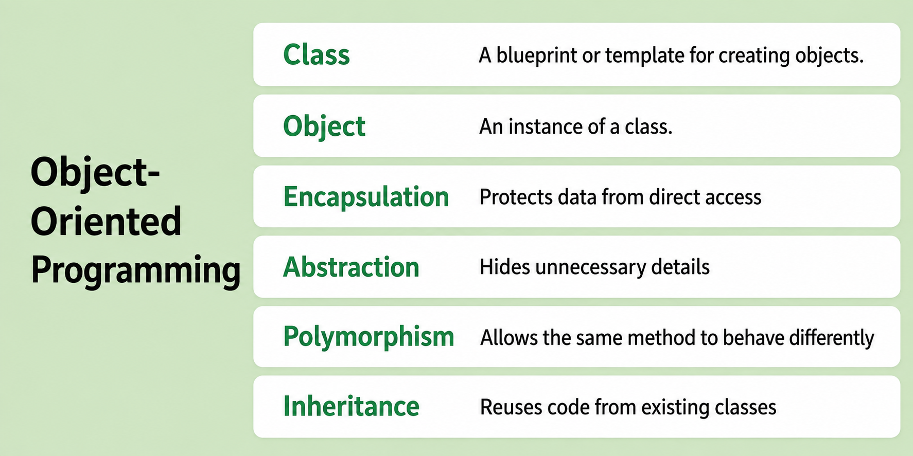
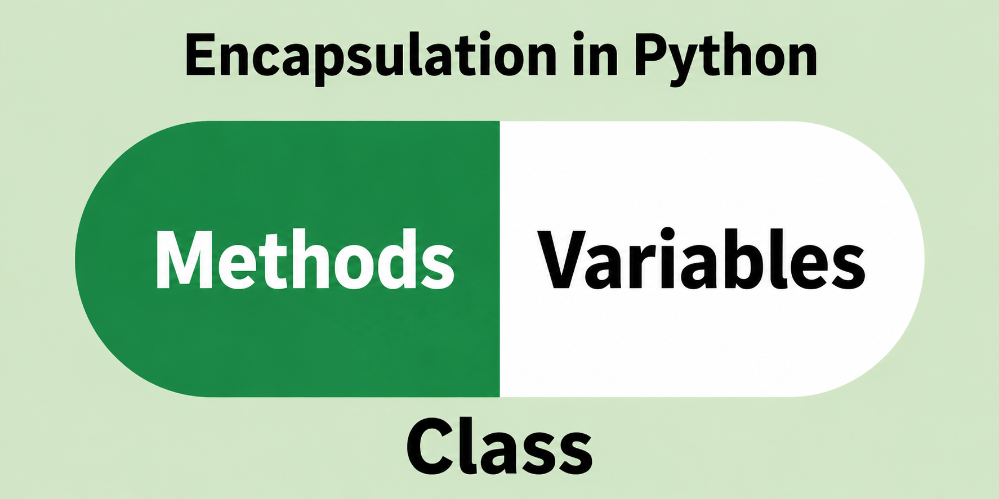
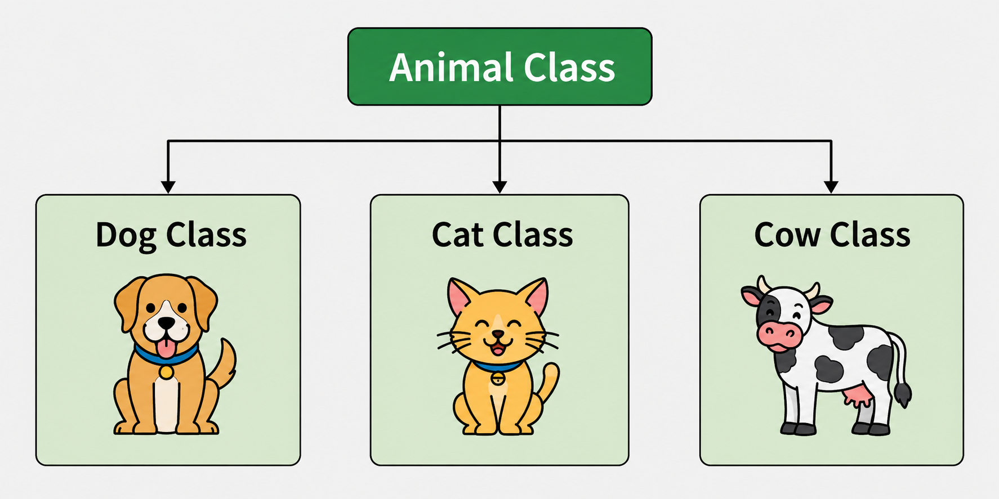
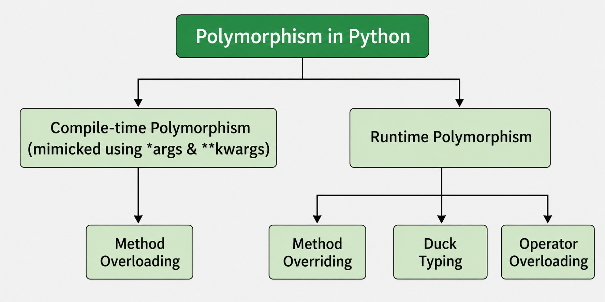
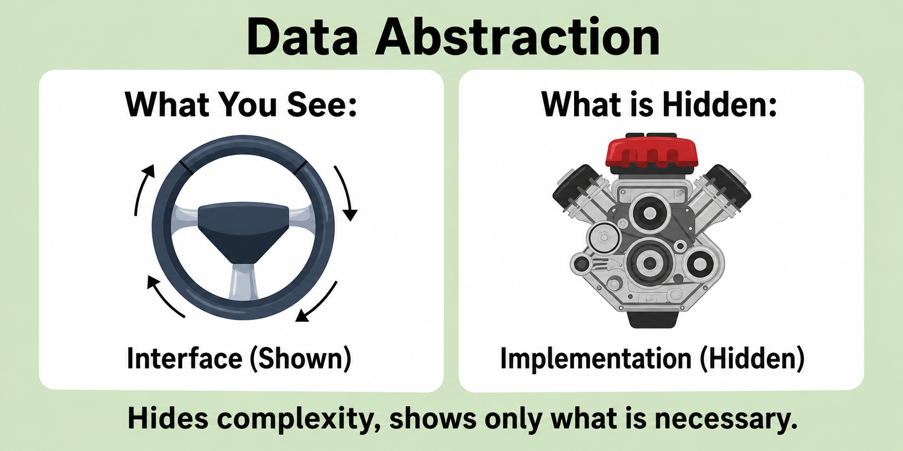

# Object-Oriented Programming in Python

## Lesson Introduction

This lesson introduces the fundamental concepts of **Object-Oriented Programming (OOP)** in Python. Learners begin with the two central concepts of **class** and **object**, then study how an object stores data through **attributes** and provides behavior through **methods**.

The lesson then explains the roles of `self`, `__init__()`, class attributes, and instance attributes before introducing the four major pillars of OOP: **Encapsulation**, **Inheritance**, **Polymorphism**, and **Abstraction**. The final part connects OOP concepts to the description and implementation of **Abstract Data Types (ADTs)** and data structures in Python.

Examples are designed at an introductory level so that learners can both understand the concepts and read/write simple Python classes. At the end of the lesson, quizzes, code-reading questions, and self-practice exercises are provided to reinforce learning.

## Knowledge and Skills You Will Gain

After completing this lesson, learners should be able to:

- Explain the concepts of **class** and **object**, and distinguish between them.
- Identify the **state**, **behavior**, and **identity** of an object.
- Distinguish between **class attributes** and **instance attributes**.
- Explain the roles of methods, `self`, and `__init__()` in a Python class.
- Define classes, create objects, and access attributes/methods using the `.` operator.
- Explain the meaning of **Encapsulation, Inheritance, Polymorphism**, and **Abstraction**.
- Use inheritance to create a new class from an existing class.
- Identify and implement **method overriding** at a basic level.
- Explain **duck typing** and how polymorphism appears in Python.
- Use `ABC` and `@abstractmethod` at a basic level to define an abstract class.
- Explain the relationship among an **ADT, interface, and implementation**.
- Implement a simple data structure such as a `Stack` using a Python class.
- Read, analyze, and predict the output of basic OOP programs.

## Lesson Structure

The lesson contains the following main topics:

1. Introduction to Object-Oriented Programming.
2. Classes and Objects.
3. Attributes and Methods.
4. `self` and `__init__()`.
5. Accessing attributes and methods using the `.` operator.
6. The four pillars of OOP:
   - Encapsulation;
   - Inheritance;
   - Polymorphism;
   - Abstraction.
7. A comprehensive example.
8. Classes and Objects in Data Structures.
9. Comparison of important OOP concepts.
10. Common mistakes.
11. Lesson summary.
12. Quizzes and review questions.
13. Self-practice exercises.
14. Quiz answers.

---

## 1. Introduction to Object-Oriented Programming

**Object-Oriented Programming (OOP)** is a way of organizing a program around **objects** and **classes**.

Instead of organizing a program only as separate functions that process data, OOP allows us to place **data** and the **operations related to that data** inside the same object.

An object usually has:

- **State:** the data currently stored in the object.
- **Behavior:** the actions that the object can perform.
- **Identity:** each object is a distinct entity in the program.

For example, a `Dog` object may have:

- state: `name`, `age`;
- behavior: `bark()`, `eat()`, `sleep()`;
- identity: two objects `dog1` and `dog2` may contain the same data but still be two different objects.

OOP is especially useful when a program contains many types of entities and each entity has its own data and operations.

The main benefits of OOP include:

- organizing programs into clear components;
- grouping data and related operations together;
- supporting code reuse;
- making programs easier to extend;
- modeling entities in a problem domain;
- improving readability, testability, and maintainability.

Four important concepts are commonly considered the pillars of OOP:

1. **Encapsulation**;
2. **Inheritance**;
3. **Polymorphism**;
4. **Abstraction**.

<p align="center">
  
</p>

---

## 2. Classes and Objects

### 2.1. What Is a Class?

A **class** is a blueprint or template used to create objects.

A class usually defines:

- the data that its objects need to store;
- the operations that its objects can perform.

In Python, a class is defined using the `class` keyword.

Example:

```python
class Dog:
    species = "Canine"

    def __init__(self, name, age):
        self.name = name
        self.age = age
```

In this example:

- `Dog` is the class name;
- `species` is a **class attribute**;
- `name` and `age` are **instance attributes**;
- `__init__()` is used to initialize the initial state of an object;
- `self` refers to the current object.

We can visualize the class as:

```text
Class Dog
   |
   +-- species
   +-- name
   +-- age
   +-- methods
```

A class is **not a specific object**. It is a general description used to create objects.

---

### 2.2. What Is an Object?

An **object** is an **instance** of a class.

Example:

```python
dog1 = Dog("Buddy", 3)
dog2 = Dog("Max", 5)
```

Both `dog1` and `dog2` are created from the `Dog` class, but they are two different objects.

```python
print(dog1.name)
print(dog2.name)
```

Output:

```text
Buddy
Max
```

We can visualize this as:

```text
             Dog
              |
        +-----+-----+
        |           |
      dog1        dog2
   name=Buddy    name=Max
   age=3         age=5
```

Objects created from the same class can store different states.

---

## 3. Attributes and Methods

### 3.1. Instance Attributes

An **instance attribute** belongs to a particular object.

Example:

```python
class Dog:
    def __init__(self, name, age):
        self.name = name
        self.age = age
```

When we create:

```python
dog1 = Dog("Buddy", 3)
dog2 = Dog("Max", 5)
```

we obtain:

```python
print(dog1.age)   # 3
print(dog2.age)   # 5
```

Each object has its own value of `age`.

---

### 3.2. Class Attributes

A **class attribute** is defined directly inside the class and outside instance methods.

Example:

```python
class Dog:
    species = "Canine"

    def __init__(self, name):
        self.name = name
```

Objects can access this shared attribute:

```python
dog1 = Dog("Buddy")
dog2 = Dog("Max")

print(dog1.species)
print(dog2.species)
```

Output:

```text
Canine
Canine
```

It can also be accessed directly through the class:

```python
print(Dog.species)
```

A class attribute is useful when a value describes a **property shared by the class as a whole**.

---

### 3.3. Methods

A **method** is a function defined inside a class.

Example:

```python
class Dog:
    def __init__(self, name):
        self.name = name

    def bark(self):
        print(f"{self.name} is barking")
```

Usage:

```python
dog1 = Dog("Buddy")
dog1.bark()
```

Output:

```text
Buddy is barking
```

A method can access and modify the state of an object through `self`.

Example:

```python
class Counter:
    def __init__(self):
        self.value = 0

    def increase(self):
        self.value += 1
```

```python
counter = Counter()

counter.increase()
counter.increase()

print(counter.value)
```

Output:

```text
2
```

---

## 4. `self` and `__init__()`

### 4.1. `self`

In an instance method, the first parameter is usually named `self`.

Example:

```python
class Student:
    def __init__(self, name):
        self.name = name

    def show_name(self):
        print(self.name)
```

When we call:

```python
student = Student("An")
student.show_name()
```

Python effectively passes the `student` object to the `self` parameter.

It can be understood approximately as:

```python
Student.show_name(student)
```

Therefore:

```python
self.name
```

means:

> the `name` attribute of the object that is currently executing the method.

`self` is not a reserved keyword in Python, but it is the standard convention and should normally be used.

---

### 4.2. `__init__()`

`__init__()` is a **special method** that Python calls after a new instance has been created.

It is commonly used to assign initial values to the object's attributes.

Example:

```python
class Student:
    def __init__(self, name, student_id):
        self.name = name
        self.student_id = student_id
```

When we write:

```python
student = Student("An", "SV001")
```

the object is initialized with:

```text
name       = "An"
student_id = "SV001"
```

In introductory materials, `__init__()` is often informally called the *constructor*. More precisely in Python, `__new__()` is responsible for creating the instance, while `__init__()` initializes the state of the instance after it has been created.

---

## 5. Accessing Attributes and Methods Using `.`

Attributes and methods are normally accessed using the dot operator `.`.

Example:

```python
class Student:
    university = "NEU"

    def __init__(self, name):
        self.name = name

    def introduce(self):
        print(f"My name is {self.name}")
```

```python
student = Student("An")

print(student.name)
print(student.university)
student.introduce()
```

Here:

```python
student.name
```

accesses an instance attribute,

```python
student.university
```

accesses a class attribute,

and:

```python
student.introduce()
```

calls a method of the object.

---

## 6. The Four Pillars of OOP

### 6.1. Encapsulation

**Encapsulation** means grouping data and the operations related to that data inside the same class.

<p align="center">
  
</p>

Example:

```python
class BankAccount:
    def __init__(self, balance):
        self.balance = balance

    def deposit(self, amount):
        self.balance += amount

    def withdraw(self, amount):
        if amount <= self.balance:
            self.balance -= amount
```

In this example:

- `balance` represents the state of the account;
- `deposit()` and `withdraw()` change that state;
- data and behavior related to the account are grouped inside `BankAccount`.

Usage:

```python
account = BankAccount(1000)

account.deposit(500)
account.withdraw(200)

print(account.balance)
```

Output:

```text
1300
```

#### Access Conventions in Python

Unlike languages such as Java or C++, Python does not enforce `public`, `protected`, and `private` in exactly the same way.

Common Python naming conventions include:

```python
name        # normal attribute
_name       # convention: intended for internal use
__name      # triggers name mangling
```

Example:

```python
class BankAccount:
    def __init__(self, balance):
        self.__balance = balance

    def get_balance(self):
        return self.__balance
```

```python
account = BankAccount(1000)

print(account.get_balance())
```

`__balance` is not an absolutely private field. Python applies **name mangling** to reduce accidental direct access from outside the class.

The main goal of encapsulation is not simply to "hide data", but to:

> control how the object's data is accessed and modified.

---

### 6.2. Inheritance

**Inheritance** allows a new class to reuse or extend the data and behavior of an existing class.

<p align="center">
  
</p>

Example:

```python
class Animal:
    def eat(self):
        print("Animal is eating")
```

We can define `Dog` as a subclass of `Animal`:

```python
class Dog(Animal):
    def bark(self):
        print("Dog is barking")
```

Usage:

```python
dog = Dog()

dog.eat()
dog.bark()
```

Output:

```text
Animal is eating
Dog is barking
```

`Dog` does not define `eat()`, but it can still use this method because it inherits from `Animal`.

A simple view:

```text
Animal
  |
  +-- eat()
  |
  v
 Dog
  |
  +-- bark()
```

Terminology:

- `Animal`: **parent class**, **base class**, or **superclass**;
- `Dog`: **child class**, **derived class**, or **subclass**.

Inheritance helps to:

- reuse code;
- represent hierarchical relationships;
- create specialized classes from more general classes.

#### Method Overriding

A child class can provide a different implementation of a method inherited from a parent class.

Example:

```python
class Animal:
    def sound(self):
        print("Some sound")


class Dog(Animal):
    def sound(self):
        print("Woof")


class Cat(Animal):
    def sound(self):
        print("Meow")
```

```python
dog = Dog()
cat = Cat()

dog.sound()
cat.sound()
```

Output:

```text
Woof
Meow
```

This is called **method overriding**.

---

### 6.3. Polymorphism

**Polymorphism** can be understood as:

> the same interface or operation can produce different behaviors depending on the object.

<p align="center">
  
</p>

Consider:

```python
class Dog:
    def sound(self):
        return "Woof"


class Cat:
    def sound(self):
        return "Meow"
```

A single function can work with both object types:

```python
def make_sound(animal):
    print(animal.sound())
```

```python
dog = Dog()
cat = Cat()

make_sound(dog)
make_sound(cat)
```

Output:

```text
Woof
Meow
```

The function:

```python
make_sound()
```

does not need to know whether the object is exactly a `Dog` or a `Cat`. It only requires the object to provide:

```python
sound()
```

This also illustrates **duck typing**, a common Python idea:

> if an object provides the operations required by the program, the program can use that object without necessarily checking its exact class.

A familiar example is `len()`:

```python
print(len("Python"))
print(len([1, 2, 3]))
print(len({"a": 1, "b": 2}))
```

The same `len()` operation works with different data types.

---

### 6.4. Abstraction

**Abstraction** focuses on describing:

> what functionality an object should provide,

instead of requiring the user to know:

> how that functionality is implemented internally.

For example, a user of a stack only needs to know operations such as:

```text
push(x)
pop()
top()
is_empty()
```

The user does not need to know whether the stack is internally implemented using:

- a list;
- a linked list;
- an array;
- or another data structure.

This idea is important when OOP is used to implement an **Abstract Data Type (ADT)**.

<p align="center">
  
</p>

In Python, the `abc` module can be used to define abstract classes.

Example:

```python
from abc import ABC, abstractmethod


class Shape(ABC):

    @abstractmethod
    def area(self):
        pass
```

The `Shape` class specifies that concrete subclasses must provide an `area()` method.

Example:

```python
class Rectangle(Shape):

    def __init__(self, width, height):
        self.width = width
        self.height = height

    def area(self):
        return self.width * self.height
```

```python
rectangle = Rectangle(4, 5)

print(rectangle.area())
```

Output:

```text
20
```

A user only needs to know:

```python
shape.area()
```

without needing to know how each shape calculates its area internally.

---

## 7. Comprehensive Example

Consider a simple employee management system.

```python
class Employee:
    company = "ABC Company"

    def __init__(self, name, salary):
        self.name = name
        self.salary = salary

    def calculate_bonus(self):
        return self.salary * 0.1

    def display(self):
        print(f"Name: {self.name}")
        print(f"Salary: {self.salary}")
```

We create a specialized class:

```python
class Manager(Employee):

    def __init__(self, name, salary, team_size):
        super().__init__(name, salary)
        self.team_size = team_size

    def calculate_bonus(self):
        return self.salary * 0.2
```

Usage:

```python
employee = Employee("An", 1000)
manager = Manager("Binh", 2000, 5)

print(employee.calculate_bonus())
print(manager.calculate_bonus())
```

Output:

```text
100.0
400.0
```

This example demonstrates several OOP concepts:

- `Employee` and `Manager` are **classes**;
- `employee` and `manager` are **objects**;
- `name`, `salary`, and `team_size` are **instance attributes**;
- `company` is a **class attribute**;
- `calculate_bonus()` and `display()` are **methods**;
- related data and operations are **encapsulated** in classes;
- `Manager` **inherits** from `Employee`;
- `Manager` **overrides** `calculate_bonus()`;
- calling the same method name `calculate_bonus()` can produce different results depending on the object, demonstrating **polymorphism**.

---

## 8. Classes and Objects in Data Structures

OOP is important when implementing **Abstract Data Types (ADTs)** and **data structures**.

Suppose we want to describe the `Stack` ADT.

At the interface level, a stack should support operations such as:

```text
push(x)
pop()
top()
is_empty()
```

We can implement a stack using a class:

```python
class Stack:

    def __init__(self):
        self._data = []

    def push(self, value):
        self._data.append(value)

    def pop(self):
        return self._data.pop()

    def top(self):
        return self._data[-1]

    def is_empty(self):
        return len(self._data) == 0
```

Usage:

```python
stack = Stack()

stack.push(10)
stack.push(20)
stack.push(30)

print(stack.top())
print(stack.pop())
```

Output:

```text
30
30
```

Here:

- `Stack` defines a type of object;
- `_data` stores the internal state of the stack;
- methods describe valid operations on the stack;
- users do not need to manipulate the internal list `_data` directly.

This is a simple example of using OOP to **encapsulate the implementation of a data structure**.

---

## 9. Comparison of Important Concepts

| Concept | Meaning |
|---|---|
| Class | A blueprint used to create objects |
| Object | A specific instance of a class |
| Attribute | Data associated with a class or object |
| Instance attribute | An attribute belonging to an individual object |
| Class attribute | An attribute defined at the class level |
| Method | A function defined inside a class |
| `self` | A reference to the current instance |
| `__init__()` | Initializes the initial state of an instance |
| Encapsulation | Groups related data and operations |
| Inheritance | Builds a new class from an existing class |
| Polymorphism | The same interface can support different behaviors |
| Abstraction | Exposes necessary functionality while hiding implementation details |

---

## 10. Common Mistakes

### Confusing a Class with an Object

Incorrect understanding:

```text
Dog is one particular dog.
```

A better interpretation:

```text
Dog is a class that describes dog objects.
dog1 is a particular object created from the Dog class.
```

---

### Confusing Class Attributes and Instance Attributes

```python
class Student:
    school = "NEU"

    def __init__(self, name):
        self.name = name
```

Here:

```python
school
```

is a class attribute, while:

```python
self.name
```

is an instance attribute.

---

### Forgetting `self`

Avoid:

```python
class Student:
    def show_name():
        print("Student")
```

For a normal instance method, use:

```python
class Student:
    def show_name(self):
        print("Student")
```

---

### Changing a Class Attribute Through an Instance

Consider:

```python
class Dog:
    species = "Canine"
```

```python
dog1 = Dog()
dog2 = Dog()

dog1.species = "Unknown"
```

Python now assigns an instance-level `species` attribute to `dog1`; this does not necessarily change `Dog.species`.

Therefore:

```python
print(dog1.species)
print(dog2.species)
print(Dog.species)
```

may produce:

```text
Unknown
Canine
Canine
```

This is an important detail when working with class attributes.

---

## 11. Summary

OOP organizes programs around **classes** and **objects**.

A class describes:

```text
Data + Operations
```

or equivalently:

```text
Attributes + Methods
```

An object is a concrete instance of a class.

Example:

```python
class Dog:
    def __init__(self, name):
        self.name = name

    def bark(self):
        print("Woof")
```

```python
dog = Dog("Buddy")
dog.bark()
```

In OOP:

- **Encapsulation** groups related data and methods;
- **Inheritance** builds new classes from existing classes;
- **Polymorphism** allows the same interface to support different behaviors;
- **Abstraction** separates the functionality users need from implementation details.

For data structures, OOP provides a natural way to implement an **ADT**:

```text
ADT
 |
 | specifies operations
 v
Class / Interface
 |
 | implemented by
 v
Concrete Data Structure
```

Example:

```text
Stack ADT
   |
   +-- push
   +-- pop
   +-- top
   +-- is_empty
          |
          v
   Stack implemented
   using Python list
```

---

## 12. Quizzes and Review Questions

### 12.1. Multiple-Choice Questions

**Question 1.** Which statement best describes a `class`?

A. A concrete object that already exists in a program.  
B. A blueprint used to create objects.  
C. A special Python method.  
D. A variable shared by all modules.

**Question 2.** In the following code, what is `name`?

```python
class Student:
    def __init__(self, name):
        self.name = name
```

A. A class attribute.  
B. An instance attribute.  
C. A global variable.  
D. An abstract method.

**Question 3.** In the following code, what is `school`?

```python
class Student:
    school = "NEU"

    def __init__(self, name):
        self.name = name
```

A. An instance attribute.  
B. A local variable.  
C. A class attribute.  
D. A method.

**Question 4.** In an instance method, `self` normally refers to:

A. The parent class.  
B. The current module.  
C. The current object.  
D. The method being called.

**Question 5.** `__init__()` is commonly used to:

A. Delete an object.  
B. Initialize the initial state of an object.  
C. Call a parent class in every case.  
D. Declare an abstract method.

**Question 6.** Which concept describes grouping data and related operations inside the same class?

A. Inheritance.  
B. Encapsulation.  
C. Polymorphism.  
D. Recursion.

**Question 7.** Which concept allows `Dog` to use a method defined in `Animal`?

```python
class Animal:
    def eat(self):
        print("Eating")


class Dog(Animal):
    pass
```

A. Encapsulation.  
B. Inheritance.  
C. Abstraction.  
D. Iteration.

**Question 8.** When a child class defines a new implementation of a method already defined in its parent class, this is called:

A. Method overriding.  
B. Method nesting.  
C. Method hiding.  
D. Object instantiation.

**Question 9.** Which code fragment most clearly demonstrates polymorphism?

A.

```python
x = 10
```

B.

```python
print(len("Python"))
print(len([1, 2, 3]))
```

C.

```python
for i in range(3):
    print(i)
```

D.

```python
import math
```

**Question 10.** Duck typing emphasizes that:

A. An object must belong to an exact predefined class.  
B. An object can be used if it provides the operations the program requires.  
C. Every class must inherit from `ABC`.  
D. Every object must have the same set of attributes.

**Question 11.** Abstraction mainly helps to:

A. Expose all implementation details to the user.  
B. Separate required functionality from internal implementation details.  
C. Completely replace inheritance.  
D. Create many identical objects.

**Question 12.** In Python, `@abstractmethod` is commonly used with:

A. `abc`.  
B. `math`.  
C. `random`.  
D. `os`.

**Question 13.** In the `Stack` example, what is the role of `_data`?

A. It stores the internal state of the stack.  
B. It is an abstract method.  
C. It is the parent class of `Stack`.  
D. It is the name of the ADT.

**Question 14.** Which statement about an ADT is correct?

A. An ADT must have exactly one implementation.  
B. An ADT specifies the operations to be provided without necessarily specifying the internal implementation.  
C. An ADT and an object are exactly the same concept.  
D. An ADT cannot be implemented using a class.

**Question 15.** What value is printed by the following program?

```python
class Counter:
    def __init__(self):
        self.value = 0

    def increase(self):
        self.value += 1


c = Counter()
c.increase()
c.increase()
print(c.value)
```

A. `0`  
B. `1`  
C. `2`  
D. The program produces an error.

---

### 12.2. True or False

Decide whether each statement is **True** or **False**.

1. One class can be used to create many objects.
2. Two objects created from the same class must always have the same values for all instance attributes.
3. `self` usually refers to the object that is calling the instance method.
4. A class attribute is always a separate attribute for each object.
5. Inheritance can support code reuse.
6. Method overriding occurs when a child class provides a new implementation of a parent-class method.
7. Abstraction requires users to know all internal implementation details.
8. One ADT can have multiple implementations.

---

### 12.3. Read the Code and Predict the Output

**Exercise 1.**

```python
class Student:
    university = "NEU"

    def __init__(self, name):
        self.name = name


s1 = Student("An")
s2 = Student("Binh")

print(s1.name)
print(s2.university)
```

Tasks:

- Predict the output.
- Identify the types of attributes `name` and `university`.

**Exercise 2.**

```python
class Dog:
    species = "Canine"


dog1 = Dog()
dog2 = Dog()

dog1.species = "Unknown"

print(dog1.species)
print(dog2.species)
print(Dog.species)
```

Tasks:

- Predict the three output lines.
- Explain why assigning `dog1.species` does not necessarily change `Dog.species`.

**Exercise 3.**

```python
class Animal:
    def sound(self):
        return "Some sound"


class Dog(Animal):
    def sound(self):
        return "Woof"


a = Animal()
d = Dog()

print(a.sound())
print(d.sound())
```

Tasks:

- Predict the output.
- Identify which method is overridden.

**Exercise 4.**

```python
class Dog:
    def sound(self):
        return "Woof"


class Cat:
    def sound(self):
        return "Meow"


def make_sound(animal):
    print(animal.sound())


make_sound(Dog())
make_sound(Cat())
```

Tasks:

- Predict the output.
- Explain why `make_sound()` can work with both `Dog` and `Cat`.
- Identify where polymorphism and duck typing appear in the example.

**Exercise 5.**

```python
class Stack:
    def __init__(self):
        self._data = []

    def push(self, value):
        self._data.append(value)

    def pop(self):
        return self._data.pop()

    def top(self):
        return self._data[-1]


stack = Stack()
stack.push(10)
stack.push(20)
stack.push(30)

print(stack.top())
print(stack.pop())
print(stack.top())
```

Tasks:

- Predict the output.
- Record the state of `_data` after each `push()` and `pop()` operation.

---

## 13. Self-Practice Exercises

The exercises below **do not include solutions**. Learners should write the programs independently, test them with different input values, and explain the OOP concepts used in their solutions.

### 13.1. Exercise 1 – Build a `Student` Class

Write a `Student` class with:

- instance attributes: `name`, `student_id`, `gpa`;
- a `display()` method to display student information;
- an `is_passed()` method that returns `True` if `gpa >= 2.0`, otherwise `False`.

Requirements:

1. Create at least three `Student` objects.
2. Display the information of each student.
3. Determine which students pass.

---

### 13.2. Exercise 2 – Class Attributes and Instance Attributes

Create a `Product` class with:

- class attribute `tax_rate = 0.1`;
- instance attributes `name`, `price`;
- method `final_price()` that returns the price including tax.

Create two products and compare:

```python
Product.tax_rate
product1.tax_rate
product2.tax_rate
```

Then execute:

```python
product1.tax_rate = 0.2
```

Observe:

```python
product1.tax_rate
product2.tax_rate
Product.tax_rate
```

Explain the result.

---

### 13.3. Exercise 3 – Encapsulation with `BankAccount`

Create a `BankAccount` class with:

- attribute `_balance`;
- method `deposit(amount)`;
- method `withdraw(amount)`;
- method `get_balance()`.

Requirements:

- do not allow deposits of zero or negative amounts;
- do not allow withdrawals of zero or negative amounts;
- do not allow withdrawals larger than the current balance;
- test both valid and invalid cases.

Finally, explain why the balance should preferably be changed through `deposit()` and `withdraw()` rather than by directly modifying `_balance`.

---

### 13.4. Exercise 4 – Inheritance

Create a parent class `Employee` with:

- `name`;
- `salary`;
- method `display()`.

Create two subclasses:

```python
class Manager(Employee):
    ...

class Developer(Employee):
    ...
```

where:

- `Manager` has an additional `team_size`;
- `Developer` has an additional `programming_language`.

Create objects of each class and verify that inherited data/methods from `Employee` can be reused.

---

### 13.5. Exercise 5 – Method Overriding and Polymorphism

Continue Exercise 4.

In `Employee`, define:

```python
def calculate_bonus(self):
    return self.salary * 0.1
```

In `Manager`, override it so that the bonus is `20%` of salary.

In `Developer`, override it so that the bonus is `15%` of salary.

Create a list containing several `Employee`, `Manager`, and `Developer` objects, then use a loop to call:

```python
employee.calculate_bonus()
```

for every object.

Explain why this demonstrates polymorphism.

---

### 13.6. Exercise 6 – Duck Typing

Create three classes:

```python
Dog
Cat
Cow
```

Each class provides:

```python
sound()
```

but returns a different result.

Write:

```python
def make_sound(animal):
    ...
```

so that the function works with all three object types without checking:

```python
type(animal)
```

or:

```python
isinstance(...)
```

---

### 13.7. Exercise 7 – Abstract Class `Shape`

Use:

```python
from abc import ABC, abstractmethod
```

to define:

```python
class Shape(ABC):
    @abstractmethod
    def area(self):
        pass
```

Then implement at least three concrete classes:

- `Rectangle`;
- `Circle`;
- `Triangle`.

Each class must provide its own implementation of `area()`.

Write a function that receives a `Shape` object and prints its area.

---

### 13.8. Exercise 8 – Implement the `Stack` ADT

Write a `Stack` class supporting:

```text
push(x)
pop()
top()
is_empty()
```

Use a Python `list` to store the internal data.

Perform the following operations:

```text
push(10)
push(20)
push(30)
top()
pop()
top()
```

Record the state of the stack after every operation.

---

### 13.9. Exercise 9 – Two Implementations of the Same ADT

Suppose the `Stack` ADT specifies four operations:

```text
push(x)
pop()
top()
is_empty()
```

Build two different classes that provide the same interface.

For example:

```python
ListStack
LinkedStack
```

Write:

```python
def test_stack(stack):
    ...
```

so that it can test both implementations without knowing how the data is stored internally.

Explain how this exercise relates to **abstraction** and **polymorphism**.

---

### 13.10. Exercise 10 – Comprehensive Exercise

Build a simple vehicle management system.

The parent class `Vehicle` has:

- `brand`;
- `speed`;
- method `move()`;
- method `display()`.

Create subclasses:

```python
Car
Bike
Truck
```

Requirements:

1. Each subclass inherits from `Vehicle`.
2. Each subclass overrides `move()` with different behavior.
3. Create at least one object from each subclass.
4. Store the objects in a list.
5. Use a loop to call `display()` and `move()` for every object.
6. Identify where the program demonstrates:
   - encapsulation;
   - inheritance;
   - polymorphism;
   - abstraction, if applicable.

---

## 14. Quiz Answers

<details>
<summary><strong>Show multiple-choice answers</strong></summary>

| Question | Answer | Question | Answer | Question | Answer |
|---|---|---|---|---|---|
| 1 | B | 6 | B | 11 | B |
| 2 | B | 7 | B | 12 | A |
| 3 | C | 8 | A | 13 | A |
| 4 | C | 9 | B | 14 | B |
| 5 | B | 10 | B | 15 | C |

</details>

<details>
<summary><strong>Show True/False answers</strong></summary>

1. True.  
2. False.  
3. True.  
4. False.  
5. True.  
6. True.  
7. False.  
8. True.

</details>

<details>
<summary><strong>Show code-reading answers</strong></summary>

**Exercise 1**

```text
An
NEU
```

`name` is an instance attribute; `university` is a class attribute.

**Exercise 2**

```text
Unknown
Canine
Canine
```

The assignment `dog1.species = "Unknown"` creates or assigns an instance-level attribute named `species` for `dog1`. The class attribute `Dog.species` remains `"Canine"`.

**Exercise 3**

```text
Some sound
Woof
```

`Dog.sound()` overrides `Animal.sound()`.

**Exercise 4**

```text
Woof
Meow
```

`make_sound()` only requires the object to provide a `sound()` method. This demonstrates polymorphism and duck typing.

**Exercise 5**

```text
30
30
20
```

The state of `_data` changes as follows:

```text
[]
[10]
[10, 20]
[10, 20, 30]
[10, 20]
```

</details>

---

## References

1. GeeksforGeeks, **Python OOP Concepts**, updated June 8, 2026:  
   https://www.geeksforgeeks.org/python/python-oops-concepts/

2. Python Documentation, **Classes**:  
   https://docs.python.org/3/tutorial/classes.html

3. Python Documentation, **abc — Abstract Base Classes**:  
   https://docs.python.org/3/library/abc.html
