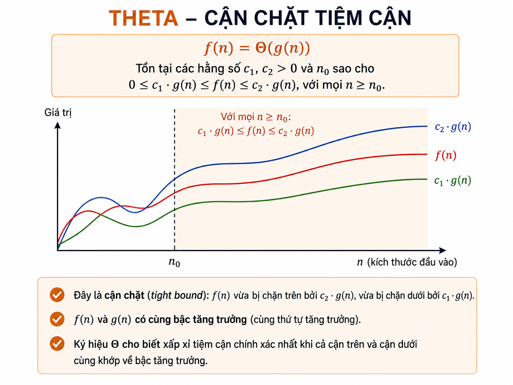

# Lecture: What is an Algorithm? Introduction to Algorithm Analysis

**Last updated:** August 31, 2026

## 1. Learning Objectives

After this lecture, learners will be able to:

1. Explain what an **algorithm** is and distinguish an algorithm from a program.
2. Identify the fundamental characteristics of a good algorithm.
3. Describe algorithms using natural language, flowcharts, and pseudocode.
4. Design a simple algorithm given a problem, input, output, and constraints.
5. Differentiate between **a priori** and **a posteriori** analysis.
6. Estimate the time and space complexity for very basic algorithms.

---

## 2. Warm-up: Why do we need algorithms?

In everyday life, we often solve tasks using an ordered sequence of steps:

- Cooking a dish following a recipe.
- Finding a person's name in a list.
- Choosing the shortest route to a destination.
- Sorting a list of scores from highest to lowest.
- Assigning delivery vehicles to multiple customers.

When the steps are described **clearly**, are **finite**, and can be executed, we are utilizing algorithmic thinking.

> **Intuitive Idea:** An algorithm is like a recipe, but described precisely enough so that a human or a computer can execute it.

<p align="center">
  
</p>

---

## 3. What is an Algorithm?

### 3.1. Definition

An **algorithm** is a finite sequence of well-defined instructions used to solve a problem or perform a computation.

In short:

> An algorithm takes input data, performs clear processing steps, and produces output after a finite number of steps.

### 3.2. General Model

```text
Input
  ↓
Algorithmic processing steps
  ↓
Output
```

Example: Find the largest of three numbers.

```text
Input:  num1, num2, num3
Process: compare the numbers
Output: the largest number
```

<p align="center">
  
</p>

---

## 4. How does an algorithm differ from a program?

| Aspect | Algorithm | Program |
|---|---|---|
| Nature | The idea, the process to solve a problem | A specific implementation of an algorithm |
| Language | Independent of programming languages | Written in Python, C++, Java, etc. |
| Level of detail | Focuses on logical steps | Includes syntax, data types, libraries, error handling |
| Goal | Describes how to solve | Executable by a computer |

For example, "iterate from left to right and store the largest value encountered" is an **algorithm**. Writing that idea in Python or C++ is a **program**.

```python
# This is a Python program implementing the find max algorithm.
def largest_of_three(a, b, c):
    largest = a
    if b > largest:
        largest = b
    if c > largest:
        largest = c
    return largest
```

---

## 5. Role and Applications of Algorithms

Algorithms are the foundation for solving problems efficiently in many fields.

| Field | Application Examples |
|---|---|
| Computer Science | Searching, sorting, data compression, graphs, operating systems |
| Mathematics | Solving systems of equations, finding shortest paths, optimization |
| Operations Research | Scheduling, vehicle routing, resource allocation |
| Artificial Intelligence | Image recognition, natural language processing, decision making |
| Data Science | Clustering, forecasting, anomaly detection |
| Finance | Fraud detection, risk analysis, automated trading |
| Logistics | Delivery optimization, warehousing, order matching, and routing |

The critical point is not just "having a solution," but having a solution that is fast enough and consumes few enough resources to be viable at a practical scale.

<p align="center">
  
</p>

---

## 6. Characteristics of an Algorithm

For a set of instructions to be considered an algorithm, the steps must possess the following characteristics.

### 6.1. Definiteness (Clear and Unambiguous)

Each step must have a single, consistent interpretation.

- Poor: "Choose a sufficiently large number."
- Better: "Set `max_value` to the first element; then sequentially compare it with the remaining elements."

For instance, the phrase "quickly sort the list" is not a sufficiently clear instruction. It is necessary to specify how to select a pivot, how to partition elements, the stopping condition, and how to merge the results.

### 6.2. Defined Input

An algorithm can take **zero or more** inputs, but the inputs must be clearly described:

- What is the data type?
- What is the acceptable domain of values?
- Are there size constraints?

Example:

```text
Input:
- n: a positive integer
- A: an array of n integers
```

### 6.3. Defined Output

The expected outcome must be clearly specified. In many textbooks, an algorithm is required to produce at least one output; for a control procedure or a state update, the "output" can be the modified state.

Example:

```text
Output:
- max_value: the maximum value in array A
```

### 6.4. Finiteness

The algorithm must terminate after a finite number of steps for all valid inputs.

Example of non-compliance:

```python
while True:
    print("Never stop")
```

Recursion also requires a **base case**. Otherwise, function calls may never terminate.

```python
def factorial(n):
    if n == 0:           # base case
        return 1
    return n * factorial(n - 1)
```

### 6.5. Effectiveness (Feasibility)

Every operation of the algorithm must be sufficiently basic so that it can be executed using a finite amount of resources.

For instance, operations like addition, comparison, variable assignment, array element access, or well-defined function calls are all executable steps.

### 6.6. Correctness

A good algorithm must return the correct result for all valid inputs.

For example, a "find the maximum element" algorithm must always return a value that is not smaller than any other element in the list.

### 6.7. Determinism and Randomized Algorithms

Many classical algorithms are **deterministic**: the same input always leads to the same sequence of steps and output.

However, **determinism is not a strict requirement for a procedure to be called an algorithm**. There are **randomized algorithms** that employ random choices, such as randomly selecting a pivot in QuickSort.

- Deterministic algorithm: same input → same behavior.
- Randomized algorithm: same input may traverse different steps; typically designed to be correct with high probability or completely correct but with varying execution times.

### 6.8. Programming Language Independence

Algorithms do not depend on Python, C++, Java, or any specific language. An algorithm can be described using pseudocode and implemented in various languages.

---

## 7. Three Common Ways to Represent Algorithms

### 7.1. Natural Language

Using ordinary sentences to describe steps.

**Example:**

1. Read three numbers.
2. Compare the first number with the other two.
3. If the first number is the largest, print it.
4. If not, check the second number.
5. Otherwise, print the third number.

**Pros:** Easy to read for simple algorithms.  
**Cons:** Prone to ambiguity for complex problems.

### 7.2. Flowchart

Flowcharts represent processes using graphical symbols:

| Symbol | Meaning |
|---|---|
| Oval | Start / End |
| Parallelogram | Input / Output |
| Rectangle | Process |
| Diamond | Conditional Branch |
| Arrow | Direction of flow |

<p align="center">
  
</p>

**Pros:** Intuitive, clearly shows conditional branches and loops.  
**Cons:** Becomes cumbersome for large algorithms.

### 7.3. Pseudocode

Pseudocode is a descriptive method close to source code but independent of any specific language's syntax.

**Example:**

```text
ALGORITHM LargestOfThree(num1, num2, num3)
    IF num1 > num2 AND num1 > num3 THEN
        largest ← num1
    ELSE IF num2 > num3 THEN
        largest ← num2
    ELSE
        largest ← num3
    END IF

    OUTPUT largest
END ALGORITHM
```

Pseudocode is often a great choice for presenting and discussing algorithms because it clarifies the logic without being bogged down by syntax details.

---

## 8. Algorithm Design Process

Before writing code, design the solution following these steps.

### Step 1. Define the problem

Answer: What needs to be solved?

Example:

```text
Problem: Find the largest of three numbers.
```

### Step 2. Determine the input

```text
Input: three numbers num1, num2, num3.
```

### Step 3. Determine the output

```text
Output: the maximum value among the three numbers.
```

### Step 4. Identify constraints

Constraints help choose the appropriate solution.

```text
- Inputs are numbers.
- They can be integers or floats.
- The three numbers can be equal.
```

### Step 5. Propose a solution idea

```text
Use conditional comparisons to identify a number that is not smaller than the other two.
```

### Step 6. Write pseudocode or flowchart

Accurately describe the steps, branches, and stopping conditions.

### Step 7. Test with sample cases

Do not only test "normal" cases, but also consider:

- Equal values.
- Negative values.
- Edge cases.
- Empty data, if the problem allows.
- Very large sizes, if performance evaluation is needed.

### Step 8. Analyze complexity

Estimate the execution time and auxiliary space before implementation or optimization.

<p align="center">
  
</p>

---

## 9. Running Example: Finding the largest of three numbers

### 9.1. Problem Specification

```text
Problem: Find the largest of three numbers.

Input:
- num1, num2, num3: three valid numbers.

Output:
- largest: the maximum value among the three numbers.
```

### 9.2. Pseudocode

```text
ALGORITHM LargestOfThree(num1, num2, num3)
    IF num1 >= num2 AND num1 >= num3 THEN
        largest ← num1
    ELSE IF num2 >= num3 THEN
        largest ← num2
    ELSE
        largest ← num3
    END IF

    OUTPUT largest
END ALGORITHM
```

> Note: Using `>=` instead of `>` explicitly handles cases with equal values, though both approaches can be adapted to return correct answers.

### 9.3. Python Implementation

```python
def largest_of_three(num1, num2, num3):
    if num1 >= num2 and num1 >= num3:
        largest = num1
    elif num2 >= num3:
        largest = num2
    else:
        largest = num3

    return largest


# Test examples
print(largest_of_three(12, 25, 18))  # 25
print(largest_of_three(7, 7, 3))     # 7
print(largest_of_three(-4, -9, -2))  # -2
```

### 9.4. Analysis

- The number of comparisons is bounded by a constant.
- It does not depend on the specific values of the three numbers.
- Uses a fixed number of variables.

Therefore:

```text
Time Complexity: O(1)
Auxiliary Space: O(1)
```

---

## 10. One Problem Can Have Multiple Algorithms

The same problem can be solved using different methods.

### Example: Finding the maximum value among three numbers

**Approach 1 — Conditional comparison**

```python
def max_by_conditions(a, b, c):
    if a >= b and a >= c:
        return a
    if b >= c:
        return b
    return c
```

**Approach 2 — Using built-in functions**

```python
def max_by_builtin(a, b, c):
    return max(a, b, c)
```

**Approach 3 — Sorting and taking the last element**

```python
def max_by_sorting(a, b, c):
    values = [a, b, c]
    values.sort()
    return values[-1]
```

With exactly three numbers, all three approaches have an asymptotic complexity of `O(1)` because the number of elements is constant. However:

- Approach 1 directly illustrates algorithmic thinking.
- Approach 2 is concise and suitable when leveraging libraries.
- Approach 3 is unnecessary for this problem as it does more work than needed.

> **Principle:** Choose an algorithm based on correctness, performance, readability, maintainability, and practical constraints.

---

## 11. What is Algorithm Analysis?

Algorithm analysis aims to evaluate the amount of resources an algorithm consumes, primarily:

1. **Time complexity**: How does the number of execution steps grow as the input size increases?
2. **Auxiliary space**: The amount of additional memory required beyond the input data.

We are generally interested in the **growth rate** as the input size `n` becomes large, rather than the exact runtime on a specific machine.

### Intuitive Examples

| Task | Approximate number of operations |
|---|---:|
| Read an element at a known position | Constant |
| Traverse an entire array of `n` elements | Proportional to `n` |
| Two nested loops, each running `n` times | Proportional to `n²` |
| Continuously halving the search range | Proportional to `log n` |

---

## 12. A Priori and A Posteriori Analysis

### 12.1. A Priori Analysis

Analysis conducted prior to implementation or execution.

- Based on the algorithmic structure.
- Counts fundamental operations or estimates the growth rate.
- Largely independent of hardware, operating systems, or compilers.
- Commonly uses asymptotic notations like `O`, `Ω`, `Θ`.

Example: A loop executing `n` times, with each iteration performing `O(1)` work, results in a total time of `O(n)`.

### 12.2. A Posteriori Analysis

Evaluation conducted after the algorithm is implemented and executed.

- Measures actual execution time.
- Measures actual memory consumption.
- Tests for correctness on sample and large datasets.
- Dependent on the machine, language, compiler/interpreter, libraries, and input data.

### 12.3. Comparison

| Criterion | A Priori | A Posteriori |
|---|---|---|
| Timing | Before executing the program | After implementation |
| Basis | Theoretical model | Empirical measurements |
| Hardware dependency | Low | High |
| Goal | Compare growth rates | Evaluate actual performance |
| Example | Proving `O(n log n)` | Measuring 0.15 seconds on a specific dataset |

Both analysis methods complement each other. An algorithm with good theoretical complexity still needs testing in practical environments.

<p align="center">
  
</p>

---

## 13. Introduction to Time Complexity

### 13.1. Why not just use seconds?

The same program may run differently depending on:

- CPU and RAM configurations.
- Programming language.
- Compiler or interpreter.
- Operating system.
- Input data.

Instead of saying "it runs in 0.2 seconds," we ask: as `n` doubles, how rapidly do the required steps increase?

### 13.2. Common Growth Rates

| Complexity | Name | Intuitive Example |
|---|---|---|
| `O(1)` | Constant | Access `A[i]` |
| `O(log n)` | Logarithmic | Binary search |
| `O(n)` | Linear | Array traversal |
| `O(n log n)` | Linearithmic | Merge sort, heapsort |
| `O(n²)` | Quadratic | Compare all pairs of elements |
| `O(2^n)` | Exponential | List all subsets |
| `O(n!)` | Factorial | List all permutations |

For sufficiently large `n`, the order of growth is generally more important than small constants:

```text
O(1) < O(log n) < O(n) < O(n log n) < O(n²) < O(2^n) < O(n!)
```

<p align="center">
  
</p>

---

## 14. Simple Analysis Examples

### Example 1: `O(1)` Time

```python
def sum_first_two(arr):
    return arr[0] + arr[1]
```

Assuming the array has at least two elements, the number of operations does not grow with `n`.

```text
Time Complexity: O(1)
Auxiliary Space: O(1)
```

### Example 2: `O(n)` Time

```python
def array_sum(arr):
    total = 0
    for x in arr:
        total += x
    return total
```

The loop executes once per element.

```text
Time Complexity: O(n)
Auxiliary Space: O(1)
```

### Example 3: `O(n²)` Time

```python
def print_all_pairs(arr):
    n = len(arr)
    for i in range(n):
        for j in range(n):
            print(arr[i], arr[j])
```

The outer loop runs `n` times; for each iteration, the inner loop also runs `n` times.

```text
Time Complexity: O(n²)
Auxiliary Space: O(1), ignoring the memory for printed output
```

### Example 4: `O(log n)` Time

```python
def count_halving_steps(n):
    steps = 0
    while n > 1:
        n //= 2
        steps += 1
    return steps
```

After each iteration, `n` is halved:

```text
n → n/2 → n/4 → n/8 → ...
```

The number of halving steps until reaching 1 is `O(log n)`.

---

## 15. Common Cognitive Errors

### Error 1. Confusing loop count with complexity

A `for` loop is not always `O(n)`.

```python
for i in range(100):
    ...
```

This is `O(1)` because 100 is a constant and does not depend on the input size `n`.

### Error 2. Two consecutive loops are always `O(n²)`

```python
for i in range(n):
    ...

for j in range(n):
    ...
```

The total is `O(n) + O(n) = O(n)`, not `O(n²)`.

### Error 3. Using sorting for every problem

Sorting can be useful but is not always necessary. If you only need to find the maximum value in an array, a single `O(n)` pass is usually better than sorting in `O(n log n)`.

### Error 4. Only measuring runtime on a single machine

Empirical measurements are important, but they cannot replace a theoretical analysis of complexity.

### Error 5. Assuming determinism is an absolute requirement

Randomized algorithms are still algorithms. The key is to clearly describe the randomization mechanism, conditions for correctness, and evaluation criteria.

---

## 16. Algorithm Design Checklist

Before writing code, verify:

- [ ] What is the problem to be solved?
- [ ] What are the data types and limits of the input?
- [ ] What is the exact expected output?
- [ ] Are there any edge cases?
- [ ] Is the algorithm guaranteed to terminate?
- [ ] Is every step unambiguous and executable?
- [ ] Is there an argument or test for correctness?
- [ ] What is the time complexity?
- [ ] What is the auxiliary space?
- [ ] Is there a simpler or more efficient solution?

---

## 17. Summary

- An algorithm is a clear, finite sequence of steps to solve a problem.
- Algorithms differ from programs: an algorithm is the method; a program is the implementation in a specific language.
- An algorithm must have specified inputs/outputs, unambiguous steps, termination, effectiveness, and correctness.
- Algorithms can be described using natural language, flowcharts, or pseudocode.
- Algorithm design should begin with the problem, input, output, constraints, idea, testing, and analysis.
- A priori analysis offers theoretical evaluation; a posteriori analysis measures actual performance.
- Time and space complexity facilitate the comparison of solutions at a large scale.

---

## 18. Review Questions

1. State the definition of an algorithm in your own words.
2. In what aspects do algorithms and programs differ?
3. Why does an algorithm require a stopping condition?
4. Provide an example of an ambiguous description and rewrite it more clearly.
5. Does an algorithm necessarily have to be deterministic? Explain.
6. Distinguish between a priori and a posteriori analysis.
7. Analyze the time complexity of the following code snippet:

```python
def count_even(arr):
    count = 0
    for x in arr:
        if x % 2 == 0:
            count += 1
    return count
```

8. Why do two consecutive loops, each running `n` times, have a complexity of `O(n)` instead of `O(n²)`?
9. Write pseudocode to find the smallest number in a non-empty array.
10. For the problem of finding the maximum element in an array, compare a single-pass traversal approach with a full sorting approach.

---

## 19. Practice Exercises

### Exercise 1 — Sum of Two Numbers

Write pseudocode and a Python program that accepts two integers `a` and `b`, then prints their sum. Determine the time and space complexity.

### Exercise 2 — Even Number Check

Write an algorithm to check whether an integer `n` is an even number.

Requirements:

- State the input and output.
- Write the pseudocode.
- Analyze the complexity.

### Exercise 3 — Finding the Minimum Value in an Array

Given an array `A` consisting of `n ≥ 1` integers. Please:

1. Write pseudocode to find the smallest element.
2. Write a Python program.
3. Analyze the time and auxiliary space complexity.
4. Test with an array containing negative numbers, duplicate elements, and a single-element array.

### Exercise 4 — Counting Positive Elements

Given an array `A` consisting of `n` integers. Count the number of elements strictly greater than 0.

Hint: You only need to traverse the array once.

### Exercise 5 — Comparing Two Solutions

Given an array `A` consisting of `n` integers. Find the largest element using two approaches:

- Approach A: Single-pass traversal.
- Approach B: Sort and retrieve the last element.

Analyze the time complexity of each approach and state which one should be preferred.

---

## 20. Suggested References

1. Cormen, Leiserson, Rivest, Stein. *Introduction to Algorithms*.
2. Sedgewick, Wayne. *Algorithms*.
3. Kleinberg, Tardos. *Algorithm Design*.
4. "What is an Algorithm | Introduction to Algorithms" introductory materials provided by the instructor, used as a foundational source for this lecture.
